# Codex Project Configuration

eSolia's unified knowledge infrastructure—the single source of truth for content, illustrations, and documentation.

## Project Overview

```mermaid
flowchart LR
    subgraph Authoring["✍️ AUTHORING"]
        H["🚀 Hanawa CMS<br/>hanawa.esolia.co.jp"]
        G["📁 Git + Claude Code<br/>Technical docs"]
        P["📋 Proposal Assembly<br/>Fragments + Templates"]
    end

    subgraph Storage["💾 STORAGE"]
        R2[("☁️ R2<br/>codex bucket")]
        DEMO["🎮 Interactive<br/>Demos"]
    end

    subgraph Distribution["📤 DISTRIBUTION"]
        MIKO["🏮 Miko AI Search<br/>codex.esolia.co.jp<br/>help.esolia.pro"]
        SP["📊 SharePoint<br/>M365 Copilot"]
        COUR["🔒 Courier<br/>Secure sharing"]
    end

    H --> R2
    G --> R2
    P --> R2
    R2 --> DEMO
    R2 --> MIKO
    R2 --> SP
    R2 --> COUR
```



## Monorepo + Deployments

This is a **monorepo** with multiple deployable packages:

```
codex/                              # This repository
├── packages/
│   ├── hanawa-cms/                 # → hanawa.esolia.co.jp
│   ├── hanawa-editor/              # Reusable Tiptap editor (npm package)
│   ├── miko-widget/                # Embeddable Q&A component
│   ├── pdf-worker/                 # Shared PDF generation service
│   ├── codex-sync/                 # Git → R2 sync worker
│   └── shared/                     # Types, branding, utilities
│
├── demos/                          # → demos.esolia.co.jp
│   ├── spf-builder/
│   ├── vpn-explainer/
│   └── ...
│
├── content/                        # Git-authored content (synced to R2)
│   ├── concepts/
│   ├── how-to/
│   ├── fragments/                  # Reusable content blocks
│   └── templates/
│
├── docs/                           # Design docs & shared resources
│   ├── concepts/                   # Architecture documents
│   └── shared/                     # Cross-repo resources (distributable)
│
└── config/                         # Central configuration
    ├── branding.yaml
    ├── collections.yaml
    └── mermaid-theme.json
```

**Key principle:** One repo, multiple deployments. Each package deploys independently.

## Hanawa Deployment Model

Hanawa is a **centralized headless CMS** at a fixed domain:


**Key difference from Lume CMS / Decap:** Those are embedded (one instance per site). Hanawa is centralized (one instance serves all sites). Sites have NO CMS code—they read from R2 at build/request time.

## Durable Objects (Future Phase)

Real-time collaboration via Tiptap + Yjs + Durable Objects is designed but deferred:

| Phase | Capability |
|-------|------------|
| **Phase 2** | Single-user Tiptap editor, auto-save to D1 |
| **Phase 5+** | Durable Objects for real-time sync (if validated) |

Start with single-user editing. Add collaboration only after validating actual need.

## Complete Content Type Taxonomy

### Public Content

| Collection | Diataxis | Site | Primary Author |
|------------|----------|------|----------------|
| `concepts` | Explanation | codex.esolia.co.jp | Git (Claude Code) |
| `how-to` | How-to | codex.esolia.co.jp | Git (Claude Code) |
| `tutorials` | Tutorial | codex.esolia.co.jp | Hanawa CMS |
| `reference` | Reference | codex.esolia.co.jp | Git |
| `blog` | Varies | esolia.co.jp | Hanawa CMS |
| `help` | How-to | help.esolia.pro | Hanawa CMS |
| `faq` | Reference | help.esolia.pro | Hanawa CMS |
| `glossary` | Reference | Multiple | Git |
| `legal` | Reference | Multiple | Git |

### Client-Specific Content

| Collection | Sensitivity | Site | Purpose |
|------------|-------------|------|---------|
| `client-docs` | Confidential | Client portals | Custom procedures |
| `proposals` | Confidential | Internal | Sales proposals |
| `reports` | Confidential | Nexus/Courier | Security assessments |
| `omiyage` | Varies | nexus.esolia.co.jp | Curated packages |

### Internal Content

| Collection | Purpose | Distribution |
|------------|---------|--------------|
| `sop` | Standard procedures | SharePoint |
| `training` | Staff materials | Internal |
| `templates` | Reusable documents | Internal |
| `runbooks` | Incident response | Internal |

### Reusable Fragments

| Collection | Purpose | Bilingual |
|------------|---------|-----------|
| `fragments/products` | Product descriptions | Yes |
| `fragments/services` | Service overviews | Yes |
| `fragments/comparisons` | License comparisons, etc. | Yes |
| `fragments/diagrams` | Reusable Mermaid/SVG | Some |
| `fragments/boilerplate` | Standard paragraphs | Yes |

## Cost-Efficient Authoring Model

**Principle:** Use Claude Max subscription for heavy lifting, API for light touches.

| Claude Max ($200/mo fixed) | API (pay per token) |
|---------------------------|---------------------|
| Claude Desktop: drafting | Fragment review (occasional) |
| Claude Desktop: translation | Miko queries (user-initiated) |
| Claude Desktop: analysis | Embedding generation |
| Claude Code: fragment authoring | |
| Claude Code: technical docs | |
| **→ Do the heavy work here** | **→ Keep this minimal** |

**Workflow:**
1. Draft in Claude Desktop → export markdown
2. Import to Hanawa (no AI, just parsing)
3. Assemble from pre-authored fragments
4. Export and share via Courier

See: `docs/concepts/proposal-workflow.md`

## Proposal & Artifact Assembly Workflow

**Current Pain Point:** Repetitive proposal creation with scattered information.

**Solution:** Fragment-based assembly in Hanawa.


### Fragment Reference Syntax

In Hanawa editor (and Claude Code-authored content):

```markdown
## Microsoft 365 Overview

{{fragment:products/m365-business-premium lang="ja"}}

## License Comparison

{{fragment:comparisons/m365-licenses lang="ja"}}

## Our Approach

{{fragment:services/implementation-methodology lang="ja"}}

## Your Specific Requirements

<!-- Client-specific content here - not a fragment -->
Based on our discussion on December 23rd, your priorities are:
1. Quick deployment before overseas partner call
2. Focus on email security first
3. Gradual device management rollout
```

### Fragment Structure

```yaml
# content/fragments/products/m365-business-premium.yaml
id: m365-business-premium
title:
  en: "Microsoft 365 Business Premium"
  ja: "Microsoft 365 Business Premium"
type: product-overview
versions:
  current: "2025-01"
content:
  en: |
    **Full Office Applications:** The license includes perpetual desktop
    versions of Word, Excel, PowerPoint, and Outlook...
  ja: |
    **フルOfficeアプリケーション:** このライセンスには、Word、Excel、
    PowerPoint、Outlookの永続デスクトップ版が含まれています...
metadata:
  last_updated: "2025-01-15"
  author: "eSolia Technical Team"
  tags: ["m365", "licensing", "productivity"]
```

## Shared Docs Distribution

The `docs/shared/` directory contains resources available across all eSolia repos.

**Source of truth:** `nexus/docs/shared/` — synced to all consuming repos via `nexus/scripts/sync-shared-docs.sh`.

**Consuming repos:** codex, pulse, periodic, chocho, pub-cogley, courier.

Each consuming repo's `CLAUDE.md` has a **Required Reading** section that directs Claude Code to read the shared guides before working on SvelteKit code.

## Related Systems Integration

```mermaid
flowchart TB
    subgraph Platform["🏛️ PLATFORM LAYER"]
        NEX["Nexus<br/>Central hub, OAuth"]
        COUR["Courier<br/>File sharing UI"]
    end

    subgraph Knowledge["📚 KNOWLEDGE LAYER (This Project)"]
        COD["Codex<br/>Content (R2)"]
        HAN["Hanawa<br/>CMS authoring"]
        MIK["Miko<br/>AI Search"]
    end

    subgraph Apps["⚙️ APPLICATION LAYER"]
        PER["Periodic<br/>DNS/email monitoring"]
        PUL["Pulse<br/>Security compliance"]
    end

    subgraph Flows["🔄 INTEGRATION FLOWS"]
        F1["Proposals → PDF → Courier → Client"]
        F2["Omiyage → Package → Nexus → Client"]
        F3["Help → R2 → help.esolia.pro"]
        F4["SharePoint → Graph API → M365"]
    end

    HAN --> COD
    COD --> MIK
    HAN --> COUR
    COUR --> NEX

    style Platform fill:#e0e7ff,stroke:#6366f1
    style Knowledge fill:#fef3c7,stroke:#f59e0b
    style Apps fill:#d1fae5,stroke:#10b981
    style Flows fill:#f3e8ff,stroke:#a855f7
```



## Required Reading

Standards are now served via the **eSolia Standards MCP server** (`/standards:*` commands).
Local copies in `docs/shared/` are kept as reference only — see `docs/shared/DEPRECATED.md`.

Before working on SvelteKit code in this project:

1. **MCP (authoritative):** Use `/standards:search sveltekit` or `get_standard('sveltekit-guide')` / `get_standard('sveltekit-backpressure')`
2. **Local fallback:** `docs/shared/guides/SVELTEKIT_GUIDE.md` and `docs/shared/guides/SVELTEKIT_BACKPRESSURE.md`

After generating code, run the preflight checks (`npm run format && npm run lint && npm run check`) before presenting results.

---

## Development Guidelines

### Critical Rules

- **NEVER** add AI attribution to commits
- **ALWAYS** run preflight checks before commits
- **ALWAYS** include InfoSec comments for security-relevant code
- **ALWAYS** validate external data with Zod schemas

### Svelte 5 Syntax

Enforced by `eslint-plugin-svelte`. See `SVELTEKIT_GUIDE.md` for the full reference.

### Preflight Commands

```bash
# SvelteKit apps (Hanawa, Demos)
npm run format && npm run lint && npm run check && npm test

# Workers (Sync, API)
npm run format && npm run lint && npm run typecheck
```

### Commit Format

```
type(scope): description

[optional body]

InfoSec: [security impact if applicable]
```

Types: `feat`, `fix`, `docs`, `style`, `refactor`, `test`, `chore`

### Mechanical Enforcement

| Constraint | Enforced by |
|------------|------------|
| No `any` types | oxlint `no-explicit-any` |
| No unsanitized `{@html}` | `esolia/no-raw-html: error` |
| Prefer `.safeParse()` | `esolia/no-schema-parse: warn` |
| No empty catch blocks | `esolia/no-silent-catch: error` |
| No platform.env leaks | `esolia/no-binding-leak: error` |
| Site-scoped queries | `esolia/no-raw-db-prepare: warn` |
| Svelte 5 runes + onclick | `eslint-plugin-svelte` |

If a constraint can be a lint rule or type, it belongs here, not in prose.

## Hanawa Editor Markdown Syntax

When creating content for Codex (via Claude Code or CMS), use these conventions:

### Callouts

```markdown
:::info{title="Note"}
General information.
:::

:::warning{title="Attention"}
Needs review.
:::

:::danger
Critical issue.
:::

:::success
Verified and complete.
:::
```

### Status Badges

```markdown
Control CC6.1 is {status:compliant id="SOC2-CC6.1"}.
Encryption is {status:in-progress}.
```

Statuses: `compliant`, `non-compliant`, `in-progress`, `not-applicable`, `pending-review`

### Evidence Links

```markdown
See the [SOC 2 Report]{evidence id="ev_abc123" type="pdf"}.
```

Types: `pdf`, `image`, `document`, `spreadsheet`, `other`

### Privacy Masks

```markdown
Client: {mask type="pii"}Acme Corp{/mask}
Revenue: {mask type="financial"}$1.2M{/mask}
```

Types: `pii`, `financial`, `internal`, `technical`, `custom`

### Fragment References

```markdown
{{fragment:products/m365-business-premium lang="ja"}}
{{fragment:comparisons/m365-licenses lang="en"}}
{{fragment:diagrams/cloudflare-security-layers}}
```

### Table of Contents

```markdown
[[toc]]
```

## Content Structure

### Markdown Frontmatter (Required)

```yaml
---
title: "Document Title"
title_ja: "ドキュメントタイトル"
slug: "document-slug"
collection: "concepts"
language: "en"
author: "eSolia Technical Team"
created: "2025-01-15"
modified: "2025-01-20"
tags: ["email-security", "spf"]
sensitivity: "normal"   # normal, confidential, embargoed
fragments_used:         # For assembled documents
  - products/m365-business-premium@2025-01
  - comparisons/m365-licenses@2025-01
---
```

### Diataxis Structure

| Type | Purpose | Verb Focus |
|------|---------|------------|
| **Tutorial** | Learning-oriented | "Learn how to..." |
| **How-to** | Task-oriented | "How to..." |
| **Reference** | Information-oriented | "Technical specs for..." |
| **Explanation** | Understanding-oriented | "Why/What is..." |

## Branding Requirements

### Colors (eSolia CI)

| Color | Hex | Usage |
|-------|-----|-------|
| Navy | `#2D2F63` | Primary text, headings |
| Orange | `#FFBC68` | Accents, borders |
| Cream | `#FFFAD7` | Backgrounds |
| Emerald | `#10b981` | Success/OK status |
| Sky | `#0ea5e9` | Warning/Info |
| Fuchsia | `#d946ef` | Error/Alert |

### Typography

- **Body**: IBM Plex Sans, IBM Plex Sans JP
- **Mono**: IBM Plex Mono

### Provenance Metadata

All published content must include:

```yaml
provenance:
  source: "esolia-codex"
  document_id: "unique-slug"
  version: "1.0"
  canonical_url: "https://codex.esolia.co.jp/..."
  created: "2025-01-15"
  modified: "2025-01-20"
  author: "eSolia Technical Team"
  language: "en"
  license: "Proprietary - eSolia Inc."
  fragments:             # If assembled from fragments
    - id: "products/m365-business-premium"
      version: "2025-01"
```

## Cloudflare Services

| Service | Purpose | Notes |
|---------|---------|-------|
| **D1** | CMS database, metadata | SQLite at the edge |
| **R2** | Content storage, media | Central bucket |
| **AI Search** | RAG retrieval | Powers Miko |
| **Workers AI** | Embeddings, LLM | 10k Neurons/day free |
| **Vectorize** | Vector storage | Up to 5M vectors free |
| **Pages** | SvelteKit hosting | Frontend apps |
| **Access** | Authentication | CMS protection |
| **Durable Objects** | Real-time collab | Tiptap sync (future) |

## Type Definitions

```typescript
// packages/hanawa-cms/src/app.d.ts
declare global {
  namespace App {
    interface Platform {
      env: {
        DB: D1Database;
        R2: R2Bucket;
        KV?: KVNamespace;
        AI: Ai;
        VECTORIZE?: VectorizeIndex;
        ENVIRONMENT: string;
        SESSION_SECRET?: string;
        PDF_API_KEY?: string;
      };
    }
    interface Locals {
      user?: {
        id: string;
        email: string;
        name: string;
        role: 'admin' | 'editor' | 'viewer';
      };
    }
  }
}
```

## Database Query Patterns

Always use parameterized queries to prevent SQL injection:

```typescript
// ✅ Correct - parameterized
const result = await db
  .prepare('SELECT * FROM content WHERE id = ? AND status = ?')
  .bind(id, 'published')
  .first();

// ❌ Wrong - SQL injection vulnerability
await db.query(`SELECT * FROM content WHERE id = '${id}'`);

// Batch operations (reduces round trips)
const [content, fragments] = await db.batch([
  db.prepare('SELECT * FROM content WHERE id = ?').bind(id),
  db.prepare('SELECT * FROM fragments WHERE category = ?').bind(category)
]);
```

## Related Documentation

### Architecture & Design
- `docs/concepts/esolia-codex-architecture-v3.md` - Full system architecture
- `docs/concepts/hanawa-cms.md` - CMS specification
- `docs/concepts/miko-ai-search.md` - AI Search integration & Miko widget
- `docs/concepts/ai-powered-docs-summary.md` - Content-as-code RAG approach
- `docs/concepts/cloudflare-innovations-summary.md` - CF platform capabilities
- `docs/concepts/cloudflare-service-bindings.md` - Worker-to-worker communication & security

### Workflows & Content
- `docs/concepts/proposal-workflow.md` - Proposal assembly
- `docs/concepts/proposal-personalization.md` - Client logos & branding customization
- `docs/concepts/fragment-workflow.md` - Fragment lifecycle & QC
- `docs/concepts/file-naming-convention.md` - File naming & client code validation
- `docs/concepts/security-content-library/` - Security education content patterns

### Proposal Fragments (content/fragments/proposals/)
- `esolia-introduction.yaml` - Mission statement opening (EN/JA)
- `esolia-profile.yaml` - Company information (EN/JA)
- `esolia-background.yaml` - Virtual IT department concept (EN/JA)
- `esolia-project-types.yaml` - Comprehensive project experience (EN/JA)
- `esolia-agreement-characteristics.yaml` - MSA/SOW terms (EN/JA)
- `esolia-service-mechanics.yaml` - Support systems & hours (EN/JA)
- `esolia-support-types.yaml` - TotalSupport vs Co-Support (EN/JA)
- `esolia-closing.yaml` - Next steps & closing (EN/JA)

### Proposal Template
- `content/templates/proposal-template.yaml` - Standard proposal structure

### Implementation
- `docs/concepts/durable-objects-for-hanawa.md` - Real-time collaboration
- `docs/concepts/sveltekit-cloudflare-cms.md` - CMS implementation
- `docs/concepts/cms-content-security.md` - Security controls
- `docs/concepts/cloudflare-media-guide.md` - Images/Stream usage

### Standards
- `docs/shared/guides/typescript-practices.md` - Coding standards
- `docs/shared/reference/esolia-branding.md` - Brand guidelines
- `schemas/fragment.json` - Fragment validation schema

## Quick Reference

### Key URLs (Production)

| Service | URL | Purpose |
|---------|-----|---------|
| Hanawa CMS | `hanawa.esolia.co.jp` | Content authoring |
| Codex Portal | `codex.esolia.co.jp` | Public knowledge base |
| Help | `help.esolia.pro` | User support |
| Demos | `demos.esolia.co.jp` | Interactive tools |
| Nexus | `nexus.esolia.co.jp` | Platform hub |
| Courier | `courier.esolia.co.jp` | Secure file sharing |

### Named Characters

| Name | Role | Purpose |
|------|------|---------|
| **Hanawa** | CMS | Named after Hanawa Hokiichi (塙保己一), blind scholar who compiled 1,273 texts |
| **Codex** | Knowledge Base | The collected repository of all eSolia knowledge |
| **Miko** | Interface | 巫女 (shrine maiden) - intermediary between people and knowledge |

## Pre-Deployment Checklist

Mechanical (enforced by `npm run verify`):
- `esolia/no-raw-html` — unsanitized {@html} (XSS)
- `esolia/no-binding-leak` — platform.env leaks
- `esolia/no-schema-parse` — .parse() without .safeParse()
- `esolia/no-silent-catch` — empty catch blocks
- `esolia/no-raw-db-prepare` — unscoped db.prepare()
- `svelte-check` — types + Svelte 5 syntax

Human review (judgment):
- [ ] Authorization checks on protected routes/data
- [ ] CSRF protection on API routes (+server.ts)
- [ ] Cookies set with `httpOnly`, `secure`, `sameSite`
- [ ] No secrets in `PUBLIC_` environment variables
- [ ] Error pages don't leak stack traces
- [ ] InfoSec comments on security-relevant code

## Changelog

| Date | Change |
|------|--------|
| 2025-12-30 | Added Svelte 5 syntax requirements, type definitions, query patterns |
| 2025-12-30 | Added proposal workflow feature to Hanawa CMS |
| 2025-12-29 | Standardized domain references to .esolia.co.jp |
| 2025-12-29 | Added SVELTEKIT_GUIDE.md and CLAUDE_PROJECT_TEMPLATE.md |

---

*Last updated: 2025-12-30*
