# Codex Project Configuration

eSolia's unified knowledge infrastructure—the single source of truth for content, illustrations, and documentation.

## Project Overview

```mermaid
flowchart LR
    subgraph Authoring["✍️ AUTHORING"]
        H["🚀 Hanawa CMS<br/>hanawa.esolia.co.jp"]
        G["📁 Git + Claude Code<br/>Technical docs"]
        P["📋 Proposal Assembly<br/>Fragments + Templates"]
    end

    subgraph Storage["💾 STORAGE"]
        R2[("☁️ R2<br/>codex bucket")]
        DEMO["🎮 Interactive<br/>Demos"]
    end

    subgraph Distribution["📤 DISTRIBUTION"]
        MIKO["🏮 Miko AI Search<br/>codex.esolia.pro<br/>help.esolia.pro"]
        SP["📊 SharePoint<br/>M365 Copilot"]
        COUR["🔒 Courier<br/>Secure sharing"]
    end

    H --> R2
    G --> R2
    P --> R2
    R2 --> DEMO
    R2 --> MIKO
    R2 --> SP
    R2 --> COUR
```



## Monorepo + Deployments

This is a **monorepo** with multiple deployable packages:

```
codex/                              # This repository
├── packages/
│   ├── hanawa-cms/                 # → hanawa.esolia.co.jp
│   ├── hanawa-editor/              # Reusable Tiptap editor (npm package)
│   ├── miko-widget/                # Embeddable Q&A component
│   ├── pdf-worker/                 # Shared PDF generation service
│   ├── codex-sync/                 # Git → R2 sync worker
│   └── shared/                     # Types, branding, utilities
│
├── demos/                          # → demos.esolia.pro
│   ├── spf-builder/
│   ├── vpn-explainer/
│   └── ...
│
├── content/                        # Git-authored content (synced to R2)
│   ├── concepts/
│   ├── how-to/
│   ├── fragments/                  # Reusable content blocks
│   └── templates/
│
├── docs/                           # Design docs & shared resources
│   ├── concepts/                   # Architecture documents
│   └── shared/                     # Cross-repo resources (distributable)
│
└── config/                         # Central configuration
    ├── branding.yaml
    ├── collections.yaml
    └── mermaid-theme.json
```

**Key principle:** One repo, multiple deployments. Each package deploys independently.

## Hanawa Deployment Model

Hanawa is a **centralized headless CMS** at a fixed domain:

```mermaid
flowchart LR
    subgraph Hanawa["🚀 hanawa.esolia.co.jp"]
        ED["Editor UI<br/>(CF Access)"]
        D1[("D1<br/>drafts/metadata")]
        PREV["Preview system"]
        FRAG["Fragment library"]
        PROP["Proposal assembly"]
    end

    R2[("☁️ R2<br/>codex bucket")]

    subgraph Sites["📡 Sites (read from R2)"]
        HELP["help.esolia.pro<br/>→ /help/*"]
        BLOG["blog.esolia.com<br/>→ /blog/*"]
        CODEX["codex.esolia.pro<br/>→ /concepts/*"]
        NEXUS["nexus.esolia.pro<br/>→ /clients/*"]
    end

    ED --> D1
    ED --> R2
    PREV --> R2
    R2 --> HELP
    R2 --> BLOG
    R2 --> CODEX
    R2 --> NEXUS

    style Hanawa fill:#fef3c7,stroke:#f59e0b
    style Sites fill:#dbeafe,stroke:#3b82f6
```



**Key difference from Lume CMS / Decap:** Those are embedded (one instance per site). Hanawa is centralized (one instance serves all sites). Sites have NO CMS code—they read from R2 at build/request time.

## Durable Objects (Future Phase)

Real-time collaboration via Tiptap + Yjs + Durable Objects is designed but deferred:

| Phase | Capability |
|-------|------------|
| **Phase 2** | Single-user Tiptap editor, auto-save to D1 |
| **Phase 5+** | Durable Objects for real-time sync (if validated) |

Start with single-user editing. Add collaboration only after validating actual need.

## Complete Content Type Taxonomy

### Public Content

| Collection | Diataxis | Site | Primary Author |
|------------|----------|------|----------------|
| `concepts` | Explanation | codex.esolia.pro | Git (Claude Code) |
| `how-to` | How-to | codex.esolia.pro | Git (Claude Code) |
| `tutorials` | Tutorial | codex.esolia.pro | Hanawa CMS |
| `reference` | Reference | codex.esolia.pro | Git |
| `blog` | Varies | esolia.com/.co.jp | Hanawa CMS |
| `help` | How-to | help.esolia.pro | Hanawa CMS |
| `faq` | Reference | help.esolia.pro | Hanawa CMS |
| `glossary` | Reference | Multiple | Git |
| `legal` | Reference | Multiple | Git |

### Client-Specific Content

| Collection | Sensitivity | Site | Purpose |
|------------|-------------|------|---------|
| `client-docs` | Confidential | Client portals | Custom procedures |
| `proposals` | Confidential | Internal | Sales proposals |
| `reports` | Confidential | Nexus/Courier | Security assessments |
| `omiyage` | Varies | nexus.esolia.pro | Curated packages |

### Internal Content

| Collection | Purpose | Distribution |
|------------|---------|--------------|
| `sop` | Standard procedures | SharePoint |
| `training` | Staff materials | Internal |
| `templates` | Reusable documents | Internal |
| `runbooks` | Incident response | Internal |

### Reusable Fragments

| Collection | Purpose | Bilingual |
|------------|---------|-----------|
| `fragments/products` | Product descriptions | Yes |
| `fragments/services` | Service overviews | Yes |
| `fragments/comparisons` | License comparisons, etc. | Yes |
| `fragments/diagrams` | Reusable Mermaid/SVG | Some |
| `fragments/boilerplate` | Standard paragraphs | Yes |

## Cost-Efficient Authoring Model

**Principle:** Use Claude Max subscription for heavy lifting, API for light touches.

| Claude Max ($200/mo fixed) | API (pay per token) |
|---------------------------|---------------------|
| Claude Desktop: drafting | Fragment review (occasional) |
| Claude Desktop: translation | Miko queries (user-initiated) |
| Claude Desktop: analysis | Embedding generation |
| Claude Code: fragment authoring | |
| Claude Code: technical docs | |
| **→ Do the heavy work here** | **→ Keep this minimal** |

**Workflow:**
1. Draft in Claude Desktop → export markdown
2. Import to Hanawa (no AI, just parsing)
3. Assemble from pre-authored fragments
4. Export and share via Courier

See: `docs/concepts/proposal-workflow.md`

## Proposal & Artifact Assembly Workflow

**Current Pain Point:** Repetitive proposal creation with scattered information.

**Solution:** Fragment-based assembly in Hanawa.

```mermaid
flowchart TB
    subgraph G["1️⃣ GATHER"]
        G1["Claude Desktop<br/>conversations"]
        G2["Team notes"]
        G3["Meeting transcripts"]
        G4["Client requirements"]
    end

    subgraph I["2️⃣ IMPORT"]
        I1["Upload/paste<br/>markdown"]
        I2["Auto-detect<br/>structure"]
        I3["Apply proposal<br/>template"]
    end

    subgraph A["3️⃣ ASSEMBLE"]
        A1["Insert fragments<br/>(EN/JA bilingual)"]
        A2["Auto-update when<br/>source changes"]
    end

    subgraph C["4️⃣ CUSTOMIZE"]
        C1["Client-specific<br/>sections"]
        C2["Pricing &<br/>timeline"]
    end

    subgraph E["5️⃣ EXPORT"]
        E1["Branded PDF<br/>with diagrams"]
        E2["Share via Courier<br/>(PIN-protected)"]
    end

    subgraph P["6️⃣ PROVENANCE"]
        P1["Full trace:<br/>fragments, versions"]
    end

    G --> I --> A --> C --> E --> P

    style G fill:#fef3c7,stroke:#f59e0b
    style I fill:#dbeafe,stroke:#3b82f6
    style A fill:#d1fae5,stroke:#10b981
    style C fill:#fce7f3,stroke:#ec4899
    style E fill:#e0e7ff,stroke:#6366f1
    style P fill:#f3e8ff,stroke:#a855f7
```



### Fragment Reference Syntax

In Hanawa editor (and Claude Code-authored content):

```markdown
## Microsoft 365 Overview

{{fragment:products/m365-business-premium lang="ja"}}

## License Comparison

{{fragment:comparisons/m365-licenses lang="ja"}}

## Our Approach

{{fragment:services/implementation-methodology lang="ja"}}

## Your Specific Requirements

<!-- Client-specific content here - not a fragment -->
Based on our discussion on December 23rd, your priorities are:
1. Quick deployment before overseas partner call
2. Focus on email security first
3. Gradual device management rollout
```

### Fragment Structure

```yaml
# content/fragments/products/m365-business-premium.yaml
id: m365-business-premium
title:
  en: "Microsoft 365 Business Premium"
  ja: "Microsoft 365 Business Premium"
type: product-overview
versions:
  current: "2025-01"
content:
  en: |
    **Full Office Applications:** The license includes perpetual desktop
    versions of Word, Excel, PowerPoint, and Outlook...
  ja: |
    **フルOfficeアプリケーション:** このライセンスには、Word、Excel、
    PowerPoint、Outlookの永続デスクトップ版が含まれています...
metadata:
  last_updated: "2025-01-15"
  author: "eSolia Technical Team"
  tags: ["m365", "licensing", "productivity"]
```

## Shared Docs Distribution

The `docs/shared/` directory contains resources that should be available across all eSolia repos.

### Distribution Strategy

**Source of truth:** `codex/docs/shared/`

```
docs/shared/
├── guides/
│   ├── typescript-practices.md
│   ├── svelte-5-migration.md
│   └── security-checklist.md
└── reference/
    ├── esolia-branding.md
    └── esolia-resource-naming.md
```

**Distribution Options:**

| Option | Method | Notes |
|--------|--------|-------|
| A | Git submodule | Complex but automatic |
| B | CI sync on push | Simpler, one-way |
| C | npm package `@esolia/dev-docs` | Versioned |
| **D** | **Symlinks in `.claude/`** | **← Pragmatic start** |

**Consuming Repos:** nexus, courier, pulse, periodic → `.claude/shared/` (symlink or copy)

### Immediate Approach

For Claude Code to reference shared docs across repos:

1. **In each repo's CLAUDE.md**, add a reference section:
   ```markdown
   ## Shared Resources (from Codex)

   When working on this project, also consult:
   - `/Users/rcogley/dev/codex/docs/shared/guides/typescript-practices.md`
   - `/Users/rcogley/dev/codex/docs/shared/reference/esolia-branding.md`
   ```

2. **Later:** Implement CI sync or npm package for automated distribution.

## Related Systems Integration


## Development Guidelines

### Critical Rules

- **NEVER** add AI attribution to commits
- **ALWAYS** run preflight checks before commits
- **ALWAYS** include InfoSec comments for security-relevant code
- **NEVER** use `any` type in TypeScript
- **ALWAYS** validate external data with Zod schemas

### Preflight Commands

```bash
# SvelteKit apps (Hanawa, Demos)
npm run format && npm run lint && npm run check && npm test

# Workers (Sync, API)
npm run format && npm run lint && npm run typecheck
```

### Commit Format

```
type(scope): description

[optional body]

InfoSec: [security impact if applicable]
```

Types: `feat`, `fix`, `docs`, `style`, `refactor`, `test`, `chore`

## Hanawa Editor Markdown Syntax

When creating content for Codex (via Claude Code or CMS), use these conventions:

### Callouts

```markdown
:::info{title="Note"}
General information.
:::

:::warning{title="Attention"}
Needs review.
:::

:::danger
Critical issue.
:::

:::success
Verified and complete.
:::
```

### Status Badges

```markdown
Control CC6.1 is {status:compliant id="SOC2-CC6.1"}.
Encryption is {status:in-progress}.
```

Statuses: `compliant`, `non-compliant`, `in-progress`, `not-applicable`, `pending-review`

### Evidence Links

```markdown
See the [SOC 2 Report]{evidence id="ev_abc123" type="pdf"}.
```

Types: `pdf`, `image`, `document`, `spreadsheet`, `other`

### Privacy Masks

```markdown
Client: {mask type="pii"}Acme Corp{/mask}
Revenue: {mask type="financial"}$1.2M{/mask}
```

Types: `pii`, `financial`, `internal`, `technical`, `custom`

### Fragment References

```markdown
{{fragment:products/m365-business-premium lang="ja"}}
{{fragment:comparisons/m365-licenses lang="en"}}
{{fragment:diagrams/cloudflare-security-layers}}
```

### Table of Contents

```markdown
[[toc]]
```

## Content Structure

### Markdown Frontmatter (Required)

```yaml
---
title: "Document Title"
title_ja: "ドキュメントタイトル"
slug: "document-slug"
collection: "concepts"
language: "en"
author: "eSolia Technical Team"
created: "2025-01-15"
modified: "2025-01-20"
tags: ["email-security", "spf"]
sensitivity: "normal"   # normal, confidential, embargoed
fragments_used:         # For assembled documents
  - products/m365-business-premium@2025-01
  - comparisons/m365-licenses@2025-01
---
```

### Diataxis Structure

| Type | Purpose | Verb Focus |
|------|---------|------------|
| **Tutorial** | Learning-oriented | "Learn how to..." |
| **How-to** | Task-oriented | "How to..." |
| **Reference** | Information-oriented | "Technical specs for..." |
| **Explanation** | Understanding-oriented | "Why/What is..." |

## Branding Requirements

### Colors (eSolia CI)

| Color | Hex | Usage |
|-------|-----|-------|
| Navy | `#2D2F63` | Primary text, headings |
| Orange | `#FFBC68` | Accents, borders |
| Cream | `#FFFAD7` | Backgrounds |
| Emerald | `#10b981` | Success/OK status |
| Sky | `#0ea5e9` | Warning/Info |
| Fuchsia | `#d946ef` | Error/Alert |

### Typography

- **Body**: IBM Plex Sans, IBM Plex Sans JP
- **Mono**: IBM Plex Mono

### Provenance Metadata

All published content must include:

```yaml
provenance:
  source: "esolia-codex"
  document_id: "unique-slug"
  version: "1.0"
  canonical_url: "https://codex.esolia.pro/..."
  created: "2025-01-15"
  modified: "2025-01-20"
  author: "eSolia Technical Team"
  language: "en"
  license: "Proprietary - eSolia Inc."
  fragments:             # If assembled from fragments
    - id: "products/m365-business-premium"
      version: "2025-01"
```

## Cloudflare Services

| Service | Purpose | Notes |
|---------|---------|-------|
| **D1** | CMS database, metadata | SQLite at the edge |
| **R2** | Content storage, media | Central bucket |
| **AI Search** | RAG retrieval | Powers Miko |
| **Workers AI** | Embeddings, LLM | 10k Neurons/day free |
| **Vectorize** | Vector storage | Up to 5M vectors free |
| **Pages** | SvelteKit hosting | Frontend apps |
| **Access** | Authentication | CMS protection |
| **Durable Objects** | Real-time collab | Tiptap sync (future) |

## Related Documentation

### Architecture & Design
- `docs/concepts/esolia-codex-architecture-v3.md` - Full system architecture
- `docs/concepts/hanawa-cms.md` - CMS specification
- `docs/concepts/miko-ai-search.md` - AI Search integration & Miko widget
- `docs/concepts/ai-powered-docs-summary.md` - Content-as-code RAG approach
- `docs/concepts/cloudflare-innovations-summary.md` - CF platform capabilities

### Workflows & Content
- `docs/concepts/proposal-workflow.md` - Proposal assembly
- `docs/concepts/proposal-personalization.md` - Client logos & branding customization
- `docs/concepts/fragment-workflow.md` - Fragment lifecycle & QC
- `docs/concepts/file-naming-convention.md` - File naming & client code validation
- `docs/concepts/security-content-library/` - Security education content patterns

### Proposal Fragments (content/fragments/proposals/)
- `esolia-introduction.yaml` - Mission statement opening (EN/JA)
- `esolia-profile.yaml` - Company information (EN/JA)
- `esolia-background.yaml` - Virtual IT department concept (EN/JA)
- `esolia-project-types.yaml` - Comprehensive project experience (EN/JA)
- `esolia-agreement-characteristics.yaml` - MSA/SOW terms (EN/JA)
- `esolia-service-mechanics.yaml` - Support systems & hours (EN/JA)
- `esolia-support-types.yaml` - TotalSupport vs Co-Support (EN/JA)
- `esolia-closing.yaml` - Next steps & closing (EN/JA)

### Proposal Template
- `content/templates/proposal-template.yaml` - Standard proposal structure

### Implementation
- `docs/concepts/durable-objects-for-hanawa.md` - Real-time collaboration
- `docs/concepts/sveltekit-cloudflare-cms.md` - CMS implementation
- `docs/concepts/cms-content-security.md` - Security controls
- `docs/concepts/cloudflare-media-guide.md` - Images/Stream usage

### Standards
- `docs/shared/guides/typescript-practices.md` - Coding standards
- `docs/shared/reference/esolia-branding.md` - Brand guidelines
- `schemas/fragment.json` - Fragment validation schema

## Quick Reference

### Key URLs (Production)

| Service | URL | Purpose |
|---------|-----|---------|
| Hanawa CMS | `hanawa.esolia.co.jp` | Content authoring |
| Codex Portal | `codex.esolia.pro` | Public knowledge base |
| Help | `help.esolia.pro` | User support |
| Demos | `demos.esolia.pro` | Interactive tools |
| Nexus | `nexus.esolia.pro` | Platform hub |
| Courier | `courier.esolia.pro` | Secure file sharing |

### Named Characters

| Name | Role | Purpose |
|------|------|---------|
| **Hanawa** | CMS | Named after Hanawa Hokiichi (塙保己一), blind scholar who compiled 1,273 texts |
| **Codex** | Knowledge Base | The collected repository of all eSolia knowledge |
| **Miko** | Interface | 巫女 (shrine maiden) - intermediary between people and knowledge |

---

*Last updated: 2025-12-29*
