# eSolia Codex

**Codex** is eSolia's unified knowledge infrastructure—a single source of truth for content, illustrations, and documentation that powers multiple products and touchpoints.

## Overview

Codex is knowledge infrastructure for eSolia—like municipal water mains feeding every building. Multiple authoring sources (CMS and Git) flow into a central reservoir (R2), which feeds distribution networks: AI Search for external access, SharePoint for M365 integration, and Courier for secure client sharing.

```mermaid
flowchart LR
    subgraph Authoring["✍️ AUTHORING"]
        H["🚀 Hanawa CMS<br/>hanawa.esolia.co.jp"]
        G["📁 Git + Claude Code<br/>Technical docs"]
        P["📋 Proposal Assembly<br/>Fragments + Templates"]
    end

    subgraph Storage["💾 STORAGE"]
        R2[("☁️ R2<br/>codex bucket")]
        DEMO["🎮 Interactive<br/>Demos"]
    end

    subgraph Distribution["📤 DISTRIBUTION"]
        MIKO["🏮 Miko AI Search<br/>codex.esolia.co.jp<br/>help.esolia.pro"]
        SP["📊 SharePoint<br/>M365 Copilot"]
        COUR["🔒 Courier<br/>Secure sharing"]
    end

    H --> R2
    G --> R2
    P --> R2
    R2 --> DEMO
    R2 --> MIKO
    R2 --> SP
    R2 --> COUR
```



## Named Components

| Name | Japanese | Role | Description |
|------|----------|------|-------------|
| **Hanawa** | 塙 | CMS | Content authoring system at `hanawa.esolia.co.jp`, named after [Hanawa Hokiichi](https://en.wikipedia.org/wiki/Hanawa_Hokiichi) (1746–1821), the blind scholar who compiled 1,273 classical texts |
| **Codex** | — | Knowledge Base | Central repository of all eSolia knowledge, stored in R2 |
| **Miko** | 巫女 | Interface | Conversational access to Codex, named after shrine maidens who serve as intermediaries |

## Monorepo Structure

This is a monorepo with multiple deployable packages:

```
codex/
├── packages/
│   ├── hanawa-cms/           # → hanawa.esolia.co.jp (v0.1.0 ✓)
│   ├── hanawa-scheduler/     # Scheduled publishing worker (✓)
│   ├── pdf-worker/           # Shared PDF generation (✓)
│   ├── miko-widget/          # Embeddable Q&A component (planned)
│   └── codex-sync/           # Git → R2 sync worker (planned)
│
├── content/                  # Git-authored content (synced to R2)
│   ├── fragments/            # Reusable content blocks (proposals/)
│   ├── proposals/            # Proposal fragments (EN/JA)
│   └── templates/            # Document templates
│
├── docs/                     # Design docs & shared resources
│   ├── README.md             # Documentation index
│   ├── ARCHITECTURE.md       # Current system architecture
│   ├── concepts/             # Architecture documents
│   └── shared/               # Cross-repo development resources
│       ├── guides/           # TypeScript, SvelteKit, security practices
│       └── reference/        # Branding, naming conventions
│
├── assets/                   # Shared assets
│   └── logos/                # eSolia logo variants
│
├── schemas/                  # JSON schemas
│   └── fragment.json         # Fragment validation schema
│
└── config/                   # Central configuration
    ├── branding.yaml         # Colors, typography
    └── collections.yaml      # Content type definitions
```

**Planned additions:**
- `demos/` - Interactive educational tools (SPF Builder, VPN Explainer, etc.)
- `content/concepts/` - Explanation articles (EN/JA)
- `content/how-to/` - Task-oriented guides

## Technology Stack

| Component | Technology | Purpose |
|-----------|------------|---------|
| **Frontend** | SvelteKit (Svelte 5) | CMS, Portal, Demos |
| **Database** | Cloudflare D1 | Content metadata, drafts |
| **Storage** | Cloudflare R2 | Published content, media |
| **Search** | Cloudflare AI Search | RAG-based retrieval |
| **AI** | Workers AI | Embeddings, generation |
| **Auth** | Cloudflare Access | CMS protection |
| **Editor** | Tiptap (ProseMirror) | Rich text editing |
| **Styling** | Tailwind CSS | UI framework |

## Authoring Paths

### Path 1: Hanawa CMS (Non-Technical Staff)

For blog posts, help articles, proposals, and client-facing documents:

- Visual editor with rich formatting and custom extensions
- Fragment library for reusable content (product descriptions, comparisons)
- Preview with security controls
- Approval workflows for sensitive content
- Direct publish to R2

### Path 2: Git Repository (Claude Code Users)

For technical documentation, concepts, and bilingual content:

- Markdown with Hanawa-compatible syntax
- Claude Code for drafting, editing, translation
- CI/CD sync to R2 on push
- Version-controlled history

Both paths converge at R2, ensuring a single source of truth.

## Content Types

### Public Content

| Collection | Purpose | Primary Path |
|------------|---------|--------------|
| **concepts** | Explanation articles ("What is SPF?") | Git |
| **how-to** | Task-oriented guides | Git |
| **tutorials** | Learning-oriented courses | CMS |
| **reference** | Technical specifications | Git |
| **blog** | News, insights, case studies | CMS |
| **help** | Support articles (help.esolia.pro) | CMS |
| **faq** | Common questions | CMS |
| **glossary** | Term definitions (EN/JA) | Git |

### Client-Specific Content

| Collection | Sensitivity | Purpose |
|------------|-------------|---------|
| **proposals** | Confidential | Sales proposals with fragment assembly |
| **client-docs** | Confidential | Custom procedures, configurations |
| **reports** | Confidential | Security assessments, audits |
| **omiyage** | Varies | Curated content packages |

### Reusable Fragments

| Category | Examples |
|----------|----------|
| **products** | M365 Business Premium overview, Cloudflare features |
| **comparisons** | E3 vs E5 vs Business Premium, hosting options |
| **services** | Implementation methodology, support tiers |
| **diagrams** | Architecture diagrams, network flows |
| **boilerplate** | Contact info, disclaimers, standard paragraphs |

## Proposal Workflow

One of the key use cases is assembling proposals efficiently:

1. **Gather** information from various sources (Claude Desktop, meeting notes, team input)
2. **Import** to Hanawa and apply a proposal template
3. **Assemble** by inserting bilingual fragments (product overviews, comparisons)
4. **Customize** with client-specific requirements and pricing
5. **Export** as branded PDF with diagrams
6. **Share** securely via Courier with full provenance tracking

## Interactive Demos (Planned)

Self-contained educational experiences that will be:
- Embedded in blog posts and help articles
- Accessed standalone at `demos.esolia.co.jp`
- Bundled into omiyage packages

Planned demos:
- SPF Record Builder
- VPN Explainer
- Routing Visualizer
- Cloud Phone System
- Cable Bend Radius
- Structured Cabling Guide

*Note: The `demos/` folder is not yet created.*

## Distribution Channels

### AI Search (Miko)

- Powers "Ask Miko" widget across eSolia properties
- Semantic search over all published content
- RAG-based answers with source citations

### SharePoint (M365)

- PDF exports to eSolia's M365 tenant
- Accessible via Copilot, Teams, Outlook search
- Same content, optimized for internal discovery

### Courier

- Secure file sharing for proposals and reports
- PIN-protected, tracked, expiring links
- Integrates with Nexus for delivery

## URLs

| Service | URL | Purpose |
|---------|-----|---------|
| Hanawa CMS | `hanawa.esolia.co.jp` | Content authoring |
| Codex Portal | `codex.esolia.co.jp` | Public knowledge base |
| Help | `help.esolia.pro` | User support articles |
| Demos | `demos.esolia.co.jp` | Interactive tools |
| Nexus | `nexus.esolia.co.jp` | Platform hub |
| Courier | `courier.esolia.co.jp` | Secure file sharing |

## Development

### Prerequisites

- Node.js 20+
- Cloudflare account with D1, R2, Workers
- GitHub account (for Git authoring path)

### Setup

```bash
# Clone repository
git clone https://github.com/esolia/codex.git
cd codex

# Install dependencies
npm install

# Copy environment template
cp .env.example .env

# Run development server
npm run dev
```

### Commands

```bash
npm run dev        # Start development server
npm run build      # Build for production
npm run preview    # Preview production build
npm run check      # Type-check
npm run lint       # Run linter
npm run format     # Format code
npm run test       # Run tests
```

## Documentation

| Document | Purpose |
|----------|---------|
| [docs/README.md](docs/README.md) | Documentation index with feature status |
| [docs/ARCHITECTURE.md](docs/ARCHITECTURE.md) | Current system architecture (Mermaid diagrams) |
| [CLAUDE.md](CLAUDE.md) | Project context for Claude Code |
| [SECURITY.md](SECURITY.md) | Security guidelines |
| [Architecture v3](docs/concepts/esolia-codex-architecture-v3.md) | Full system vision |
| [Hanawa CMS](docs/concepts/hanawa-cms.md) | CMS specification |
| [Feature Roadmap](docs/concepts/hanawa-features/00-feature-roadmap.md) | Feature specs & status |
| [Proposal Workflow](docs/concepts/proposal-workflow.md) | Proposal assembly |
| [Fragment Workflow](docs/concepts/fragment-workflow.md) | Fragment lifecycle & QC |
| [Content Security](docs/concepts/cms-content-security.md) | Security controls |
| [Miko AI Search](docs/concepts/miko-ai-search.md) | AI search interface |
| [TypeScript Practices](docs/shared/guides/typescript-practices.md) | Coding standards |
| [Branding](docs/shared/reference/esolia-branding.md) | Visual identity |

## Related Projects

| Project | Purpose |
|---------|---------|
| [Nexus](https://github.com/esolia/nexus) | Platform hub, OAuth, secure sharing backend |
| [Courier](https://github.com/esolia/courier) | Secure file sharing UI |
| [Periodic](https://github.com/esolia/periodic) | DNS/email monitoring |
| [Pulse](https://github.com/esolia/pulse) | Security compliance tracking |

## Contributing

See [CLAUDE.md](CLAUDE.md) for development guidelines and coding standards.

Key points:
- Follow TypeScript practices (no `any`, explicit types)
- Include InfoSec comments for security-relevant code
- Use conventional commit format
- Run preflight checks before commits

## License

Proprietary - eSolia Inc.

---

*Codex: Where eSolia's knowledge lives.*
