# Security Policy

This document outlines security considerations for the eSolia Codex platform.

## Security Model

Codex handles content with varying sensitivity levels. Security controls are applied proportionally based on content classification.

### Content Security Matrix

| Control | 🟢 Normal | 🟡 Confidential | 🔴 Embargoed |
|---------|-----------|-----------------|--------------|
| **Storage** | Plaintext | Encrypted | Encrypted |
| **Editor Access** | Any editor | Assigned only | Assigned only |
| **Preview Auth** | CF Access | CF Access | CF Access |
| **Share Preview** | Immediate | After approval | After embargo |
| **Token Expiry** | 7 days | 24 hours | 4 hours |
| **Max Views** | Unlimited | 10 | 3 |
| **IP Restrict** | Optional | Recommended | Required |
| **Audit Level** | Standard | Detailed | Full + alerts |

## Authentication & Authorization

### CMS Access (Hanawa)

- **Primary Auth**: Cloudflare Access (Zero Trust)
- **Session**: JWT with organization binding
- **MFA**: Required for confidential/embargoed content access

### Preview Links

Shareable previews use token-based authentication:

```
https://codex.esolia.co.jp/preview/{token}
```

Token validation includes:
- Expiration check (configurable per sensitivity level)
- View count limit
- Optional IP allowlist
- Audit logging of all access attempts

### API Authentication

- Workers receive requests through Cloudflare Access
- API tokens for CI/CD with minimal scope
- No service accounts with broad permissions

## Content Classification

### Normal

Standard content with no special handling:
- Blog posts, general help articles
- Public documentation
- Marketing materials

### Confidential

Business-sensitive content requiring approval:
- Client-specific documentation
- Internal procedures
- Pre-release feature documentation

**Additional Controls:**
- Preview sharing requires manager approval
- Encrypted at rest in D1
- Shorter token expiry (24 hours)
- Limited view count (10 max)

### Embargoed

Time-sensitive content with strict controls:
- Acquisition announcements
- Earnings data
- Regulatory filings

**Additional Controls:**
- No preview until embargo lifts (or explicit override)
- Encrypted at rest
- Very short token expiry (4 hours)
- Minimal view count (3 max)
- IP restriction required
- Real-time alerts on access

## Threat Model

### Pre-Authentication Vectors

| Threat | Mitigation |
|--------|------------|
| URL guessing | Random UUIDs, no enumerable IDs |
| Token brute force | High entropy tokens (UUIDv4) |
| Search engine indexing | `X-Robots-Tag: noindex, nofollow` on previews |
| Edge caching leaks | `Cache-Control: private, no-store` on previews |

### Post-Authentication Vectors

| Threat | Mitigation |
|--------|------------|
| Unauthorized sharing | Visible watermarks, audit logging |
| Browser history exposure | Short-lived tokens, session-only cookies |
| Screenshot/copy-paste | Forensic watermarking, psychological deterrents |
| API response caching | `no-store` headers, validation tokens |

### Infrastructure Vectors

| Threat | Mitigation |
|--------|------------|
| D1 direct access | Workers-only access, no exposed connection strings |
| R2 public access | Signed URLs, no public bucket |
| Log data exposure | No sensitive content in logs |
| Backup leakage | Encrypted exports, access controls |

## Data Protection

### Encryption

| Layer | Method | Key Management |
|-------|--------|----------------|
| Transit | TLS 1.3 (Cloudflare) | Cloudflare managed |
| At Rest (D1) | SQLite encryption | D1 managed |
| At Rest (R2) | S3-compatible encryption | R2 managed |
| Application Layer | AES-256-GCM | Secrets in Workers |

### Sensitive Content Encryption

Confidential and embargoed content receives additional application-layer encryption:

```typescript
// Content encrypted before D1 storage
const encrypted = await crypto.subtle.encrypt(
  { name: 'AES-GCM', iv },
  key,
  content
);
```

### Data Retention

| Data Type | Retention | Deletion |
|-----------|-----------|----------|
| Published content | Indefinite | Manual |
| Draft content | 90 days after last edit | Automatic |
| Audit logs | 2 years | Automatic |
| Preview tokens | Until expiry | Automatic |
| Session data | 24 hours | Automatic |

## OWASP Top 10 Compliance

### A01: Broken Access Control

- Cloudflare Access for all admin routes
- Organization-scoped queries (tenant isolation)
- Role-based permissions in D1
- Preview tokens with strict validation

### A02: Cryptographic Failures

- TLS 1.3 for all connections
- AES-256-GCM for sensitive content
- No sensitive data in URLs
- Secure token generation (crypto.randomUUID)

### A03: Injection

- Parameterized D1 queries (prepared statements)
- Input validation with Zod schemas
- Output encoding for HTML (regex-based sanitization, Workers-compatible)
- CSP headers on all responses

### A04: Insecure Design

- Defense in depth (multiple security layers)
- Content classification from creation
- Approval workflows for sensitive content
- Regular security reviews

### A05: Security Misconfiguration

- Cloudflare-managed infrastructure
- Minimal permissions on API tokens
- Security headers on all responses
- Regular configuration audits

### A06: Vulnerable Components

- Dependabot for dependency updates
- npm audit in CI/CD
- Minimal dependencies
- Regular security patches

### A07: Auth Failures

- Cloudflare Access (no custom auth)
- Token expiration enforcement
- No password storage
- Session invalidation on logout

### A08: Data Integrity Failures

- Content versioning in D1
- Audit logging for all changes
- Preview token validation
- CI/CD pipeline integrity

### A09: Logging & Monitoring

- Comprehensive audit logging
- Real-time alerts for embargoed access
- Log aggregation (Cloudflare Logs)
- Anomaly detection (future)

### A10: SSRF

- No user-controlled external requests
- R2 bucket access through Workers only
- Validated URL patterns for media
- No open redirects

## Security Headers

All responses include:

```http
Content-Security-Policy: default-src 'self'; script-src 'self'; style-src 'self' 'unsafe-inline'; img-src 'self' data: https:; frame-ancestors 'none'
X-Content-Type-Options: nosniff
X-Frame-Options: DENY
X-XSS-Protection: 0
Referrer-Policy: strict-origin-when-cross-origin
Permissions-Policy: camera=(), microphone=(), geolocation=()
```

Preview pages add:

```http
X-Robots-Tag: noindex, nofollow, noarchive, nosnippet
Cache-Control: private, no-store, no-cache, must-revalidate
```

## Proposal & Client Document Security

Proposals and client-specific documents require additional security considerations.

### Proposal Lifecycle Security

```mermaid
flowchart TB
    subgraph DRAFT["📝 DRAFT PHASE"]
        D1["Stored in D1<br/>(encrypted for confidential)"]
        D2["Accessible only to<br/>assigned authors"]
        D3["Fragment refs resolved<br/>at view time"]
        D4["Auto-save with<br/>version history"]
    end

    subgraph REVIEW["👀 REVIEW PHASE"]
        R1["Preview links with<br/>restricted access"]
        R2["Watermarked with<br/>reviewer identity"]
        R3["Comments stored separately<br/>(never in PDF)"]
        R4["Approval workflow<br/>before export"]
    end

    subgraph EXPORT["📄 EXPORT PHASE"]
        E1["Fragments baked in<br/>(snapshot)"]
        E2["Provenance metadata<br/>embedded in PDF"]
        E3["Export logged with<br/>recipient info"]
        E4["PDF watermarked<br/>if confidential"]
    end

    subgraph DELIVERY["🔒 DELIVERY (Courier)"]
        L1["PIN-protected access"]
        L2["View tracking<br/>and limits"]
        L3["Expiring links<br/>(7 days default)"]
        L4["Download audit trail"]
    end

    DRAFT --> REVIEW
    REVIEW --> EXPORT
    EXPORT --> DELIVERY

    style DRAFT fill:#fef3c7,stroke:#f59e0b
    style REVIEW fill:#dbeafe,stroke:#3b82f6
    style EXPORT fill:#d1fae5,stroke:#10b981
    style DELIVERY fill:#fce7f3,stroke:#ec4899
```



### Fragment Security

Fragments are reusable content blocks that may contain sensitive information:

| Fragment Type | Sensitivity | Controls |
|---------------|-------------|----------|
| Product descriptions | Normal | None |
| Pricing tables | Internal | Editor-only access |
| Client-specific terms | Confidential | Per-client access |
| Implementation details | Internal | Staff-only |

**Fragment Access Rules:**
- Fragments inherit sensitivity from their classification
- Confidential fragments require explicit grant to reference
- Fragment usage is logged in provenance metadata
- Updates to fragments trigger review of referencing documents

### Provenance & Audit Trail

Every assembled document includes provenance metadata:

```yaml
provenance:
  document_id: "proposal-acme-2025-01"
  created: "2025-01-15T10:30:00Z"
  created_by: "rick.cogley@esolia.co.jp"
  modified: "2025-01-20T14:45:00Z"
  modified_by: "rick.cogley@esolia.co.jp"
  exported: "2025-01-20T15:00:00Z"
  exported_by: "rick.cogley@esolia.co.jp"

  fragments_used:
    - id: "products/m365-business-premium"
      version: "2025-01-v2"
      included_at: "2025-01-15T10:35:00Z"
    - id: "comparisons/m365-licenses"
      version: "2025-01-v1"
      included_at: "2025-01-15T10:40:00Z"

  delivery:
    method: "courier"
    share_id: "shr_abc123"
    recipient: "client@example.com"
    delivered_at: "2025-01-20T15:05:00Z"
    expires_at: "2025-01-27T15:05:00Z"
```

### Courier Integration Security

When sharing proposals via Courier:

- **Authentication**: Recipient must enter PIN to access
- **Tracking**: All views logged with IP, user agent, timestamp
- **Limits**: Configurable view count and time expiry
- **Revocation**: Shares can be revoked immediately
- **Audit**: Full trail from creation to final access

See also: [Courier Security](https://github.com/esolia/courier)

## Audit Logging

All security-relevant events are logged:

| Event | Data Captured |
|-------|---------------|
| `auth.login` | User, method, IP, user agent |
| `auth.logout` | User, session duration |
| `content.create` | User, collection, sensitivity |
| `content.update` | User, document, fields changed |
| `content.publish` | User, document, distribution channels |
| `preview.create` | User, document, token, expiry, restrictions |
| `preview.view` | Token, IP, user agent, success/failure |
| `preview.reject` | Token, IP, reason |
| `sensitivity.change` | User, document, old→new level |
| `proposal.create` | User, client, template used |
| `proposal.fragment_add` | User, document, fragment ID, version |
| `proposal.export` | User, document, format, recipient |
| `proposal.share` | User, document, Courier share ID |
| `fragment.update` | User, fragment ID, old→new version |
| `fragment.access` | User, fragment ID, purpose |

## Incident Response

### Reporting Security Issues

Report security vulnerabilities to: **security@esolia.co.jp**

Include:
- Description of the vulnerability
- Steps to reproduce
- Potential impact
- Suggested remediation (if any)

### Response Timeline

| Severity | Initial Response | Resolution Target |
|----------|------------------|-------------------|
| Critical | 4 hours | 24 hours |
| High | 24 hours | 7 days |
| Medium | 72 hours | 30 days |
| Low | 7 days | 90 days |

### Incident Types

| Type | Response |
|------|----------|
| Unauthorized access | Revoke tokens, audit logs, notify affected |
| Content leak | Forensic analysis, source identification, notify affected |
| Service compromise | Isolate, rotate credentials, full audit |
| Dependency vulnerability | Assess exposure, patch, monitor |

## Development Security

### Code Review Requirements

All security-relevant changes require:

1. **InfoSec comment** explaining the security consideration
2. **Peer review** by security-conscious reviewer
3. **Automated checks** (linting, type-check, tests)

Example:

```typescript
// InfoSec: Validate tenant isolation - prevents IDOR
const { results } = await db
  .prepare('SELECT * FROM documents WHERE id = ? AND org_id = ?')
  .bind(id, locals.orgId)
  .all();
```

### Pre-commit Checks

```bash
# Required before any commit
npm run format
npm run lint
npm run check
npm run test
npm audit
```

### Secret Management

- No secrets in code or version control
- Use Cloudflare Workers Secrets
- Rotate credentials regularly
- Minimal secret scope

## Compliance

### Standards

- **OWASP Top 10** - Web application security
- **ISO 27001** - Information security management (alignment)
- **GDPR** - Data protection (EU clients)
- **Act on Protection of Personal Information** - Japan privacy law

### Regular Reviews

| Review | Frequency | Scope |
|--------|-----------|-------|
| Dependency audit | Weekly (automated) | npm packages |
| Access review | Monthly | User permissions |
| Security configuration | Quarterly | Infrastructure settings |
| Penetration test | Annually | Full platform |

---

*Last updated: 2025-12-29*
*Security contact: security@esolia.co.jp*
