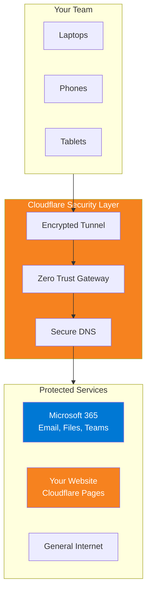

Every device connects through Cloudflare's network. Malicious sites are
blocked before they load. Your website is protected from attacks. Your
team works securely from anywhere—home, serviced office, or a hotel or café.
