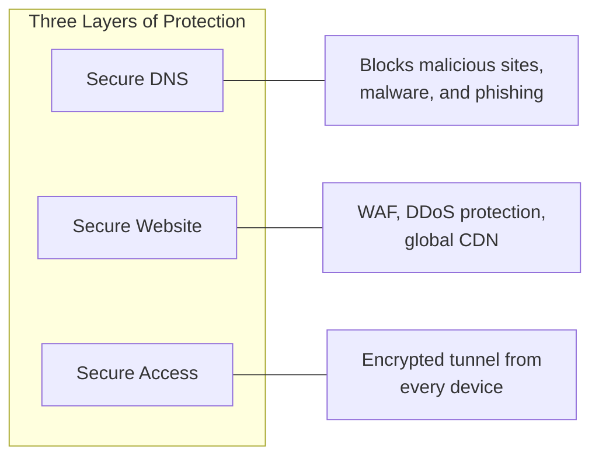

Cloudflare provides three integrated security layers: DNS filtering to
block threats before they reach your network, web application protection
for your online presence, and encrypted tunnels for secure remote access.
