```mermaid
flowchart TB
    internet["🌐 Fiber Internet<br/>(ISP)"]
    ont["ONT / ONU"]

    subgraph rack["Office Rack"]
        ups["UPS<br/>(Rack Mount)"]
        fw["FortiWifi<br/>Firewall · Router · Wi-Fi"]
        sw["FortiSwitch<br/>Managed Switch"]
    end

    subgraph wired["Wired Devices"]
        desktop["🖥️ Desktops"]
        printer["🖨️ Printers"]
        phone["📞 IP Phones"]
    end

    subgraph wireless["Wireless Devices"]
        laptop["💻 Laptops"]
        mobile["📱 Mobile"]
        tablet["Tablets"]
    end

    internet --- ont
    ont --- fw
    fw --- sw
    sw --- desktop
    sw --- printer
    sw --- phone
    fw -.-|"Wi-Fi"| laptop
    fw -.-|"Wi-Fi"| mobile
    fw -.-|"Wi-Fi"| tablet

    ups ~~~ fw
    ups ~~~ sw

    style rack fill:#fef3c7,stroke:#f59e0b
    style wired fill:#dbeafe,stroke:#3b82f6
    style wireless fill:#d1fae5,stroke:#10b981
    style fw fill:#e11d48,color:#fff
    style sw fill:#e11d48,color:#fff
```

光ファイバーインターネットがFortiWifiに接続し、オフィスのファイアウォール、ルーティング、無線を担います。FortiSwitchはデスクトップPC、プリンター、電話機への有線接続を提供します。すべての機器はUPS電源保護付きのコンパクトラックに収納されます。無線デバイスはFortiWifiの内蔵アクセスポイントから直接接続します。
