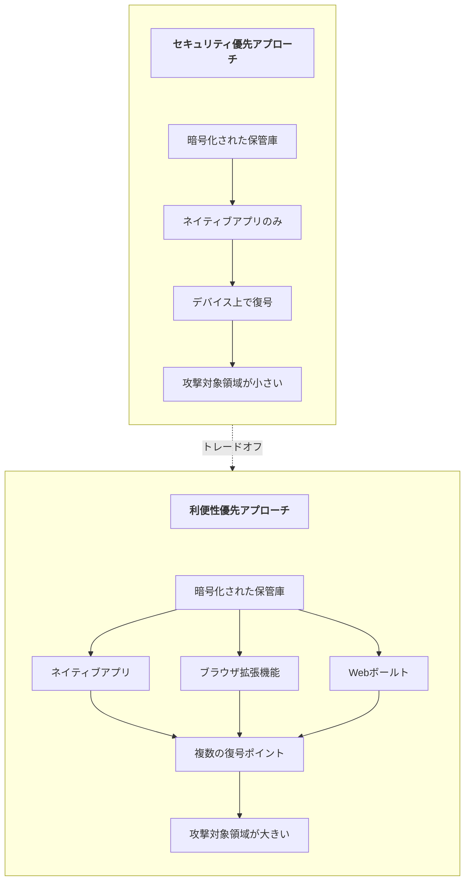

```mermaid
flowchart TD
    subgraph SF[" "]
        direction TB
        SF_Title["<b>セキュリティ優先アプローチ</b>"]
        A1[暗号化された保管庫] --> A2[ネイティブアプリのみ]
        A2 --> A3[デバイス上で復号]
        A3 --> A4[攻撃対象領域が小さい]
        SF_Title ~~~ A1
    end

    subgraph CF[" "]
        direction TB
        CF_Title["<b>利便性優先アプローチ</b>"]
        B1[暗号化された保管庫] --> B2[ネイティブアプリ]
        B1 --> B3[ブラウザ拡張機能]
        B1 --> B4[Webボールト]
        B2 --> B5[複数の復号ポイント]
        B3 --> B5
        B4 --> B5
        B5 --> B6[攻撃対象領域が大きい]
        CF_Title ~~~ B1
    end

    SF -.->|"トレードオフ"| CF
```

セキュリティ優先と利便性優先のアーキテクチャ比較
