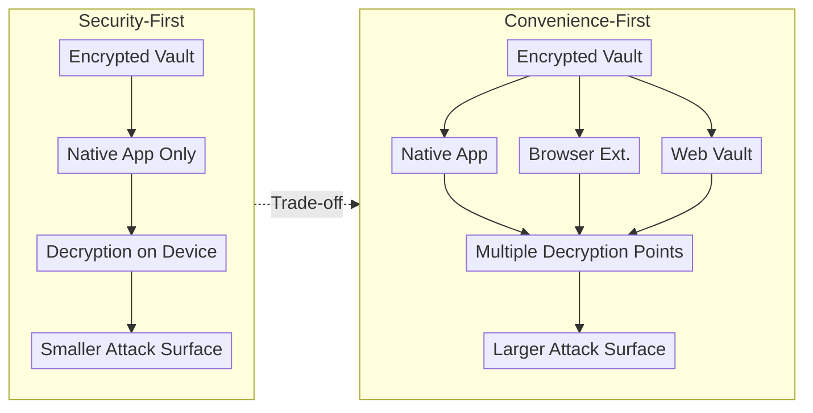

```mermaid
%%{init: {'flowchart': {'nodeSpacing': 20, 'rankSpacing': 30, 'padding': 4}}}%%
flowchart LR
    subgraph SF["Security-First"]
        direction TB
        A1[Encrypted Vault] --> A2[Native App Only]
        A2 --> A3[Decryption on Device]
        A3 --> A4[Smaller Attack Surface]
    end

    subgraph CF["Convenience-First"]
        direction TB
        B1[Encrypted Vault] --> B2[Native App] & B3[Browser Ext.] & B4[Web Vault]
        B2 & B3 & B4 --> B5[Multiple Decryption Points]
        B5 --> B6[Larger Attack Surface]
    end

    SF -.->|"Trade-off"| CF
```
