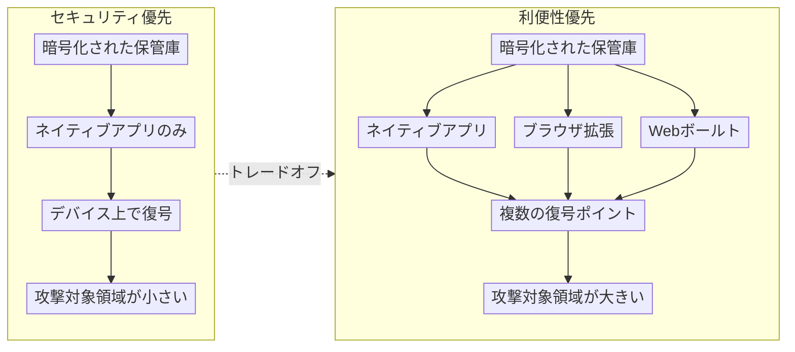

```mermaid
%%{init: {'flowchart': {'nodeSpacing': 20, 'rankSpacing': 30, 'padding': 4}}}%%
flowchart LR
    subgraph SF["セキュリティ優先"]
        direction TB
        A1[暗号化された保管庫] --> A2[ネイティブアプリのみ]
        A2 --> A3[デバイス上で復号]
        A3 --> A4[攻撃対象領域が小さい]
    end

    subgraph CF["利便性優先"]
        direction TB
        B1[暗号化された保管庫] --> B2[ネイティブアプリ] & B3[ブラウザ拡張] & B4[Webボールト]
        B2 & B3 & B4 --> B5[複数の復号ポイント]
        B5 --> B6[攻撃対象領域が大きい]
    end

    SF -.->|"トレードオフ"| CF
```
