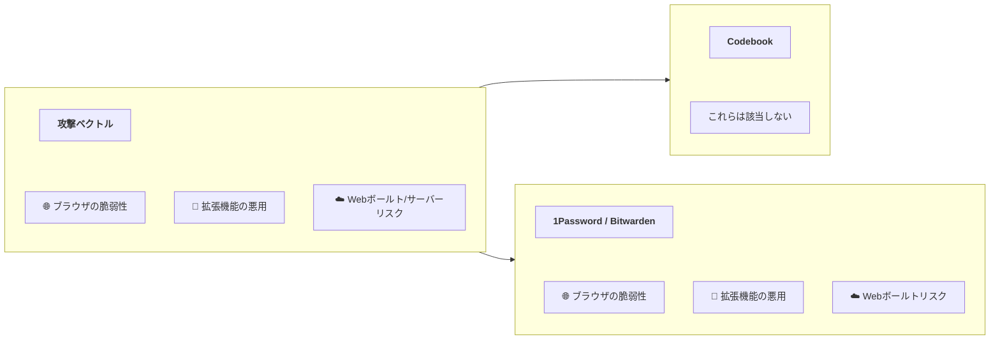

```mermaid
flowchart LR
    subgraph Vectors[" "]
        direction TB
        V_Title["<b>攻撃ベクトル</b>"]
        AV2["🌐 ブラウザの脆弱性"]
        AV3["🧩 拡張機能の悪用"]
        AV4["☁️ Webボールト/サーバーリスク"]
        V_Title ~~~ AV2
    end

    subgraph Codebook[" "]
        direction TB
        C_Title["<b>Codebook</b>"]
        C1["これらは該当しない"]
        C_Title ~~~ C1
    end

    subgraph Traditional[" "]
        direction TB
        T_Title["<b>1Password / Bitwarden</b>"]
        T2["🌐 ブラウザの脆弱性"]
        T3["🧩 拡張機能の悪用"]
        T4["☁️ Webボールトリスク"]
        T_Title ~~~ T2
    end

    Vectors --> Codebook
    Vectors --> Traditional
```

Security architecture differences against attack vectors
