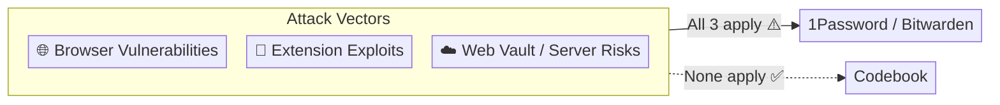

```mermaid
%%{init: {'flowchart': {'nodeSpacing': 20, 'rankSpacing': 30, 'padding': 4}}}%%
flowchart LR
    subgraph Attacks["Attack Vectors"]
        direction TB
        A1["🌐 Browser Vulnerabilities"]
        A2["🧩 Extension Exploits"]
        A3["☁️ Web Vault / Server Risks"]
    end
    Attacks -->|"All 3 apply ⚠️"| T["1Password / Bitwarden"]
    Attacks -.->|"None apply ✅"| C["Codebook"]
```
