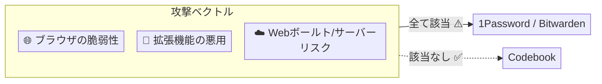

```mermaid
%%{init: {'flowchart': {'nodeSpacing': 20, 'rankSpacing': 30, 'padding': 4}}}%%
flowchart LR
    subgraph Attacks["攻撃ベクトル"]
        direction TB
        A1["🌐 ブラウザの脆弱性"]
        A2["🧩 拡張機能の悪用"]
        A3["☁️ Webボールト/サーバーリスク"]
    end
    Attacks -->|"全て該当 ⚠️"| T["1Password / Bitwarden"]
    Attacks -.->|"該当なし ✅"| C["Codebook"]
```
