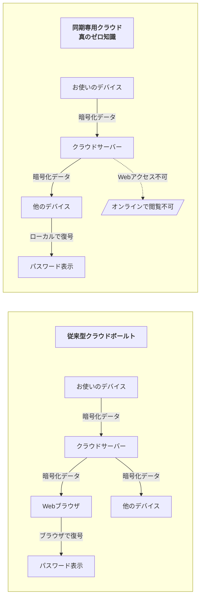

```mermaid
flowchart LR
    subgraph Traditional[" "]
        direction TB
        T_Title["<b>従来型クラウドボールト</b>"]
        T1[お使いのデバイス] -->|"暗号化データ"| T2[クラウドサーバー]
        T2 -->|"暗号化データ"| T3[Webブラウザ]
        T3 -->|"ブラウザで復号"| T4[パスワード表示]
        T2 -->|"暗号化データ"| T5[他のデバイス]
        T_Title ~~~ T1
    end

    subgraph SyncOnly[" "]
        direction TB
        S_Title["<b>同期専用クラウド<br/>真のゼロ知識</b>"]
        S1[お使いのデバイス] -->|"暗号化データ"| S2[クラウドサーバー]
        S2 -->|"暗号化データ"| S3[他のデバイス]
        S2 -.->|"Webアクセス不可"| S4[/"オンラインで閲覧不可"/]
        S3 -->|"ローカルで復号"| S5[パスワード表示]
        S_Title ~~~ S1
    end
```

Difference between traditional cloud vault and true zero-knowledge sync
