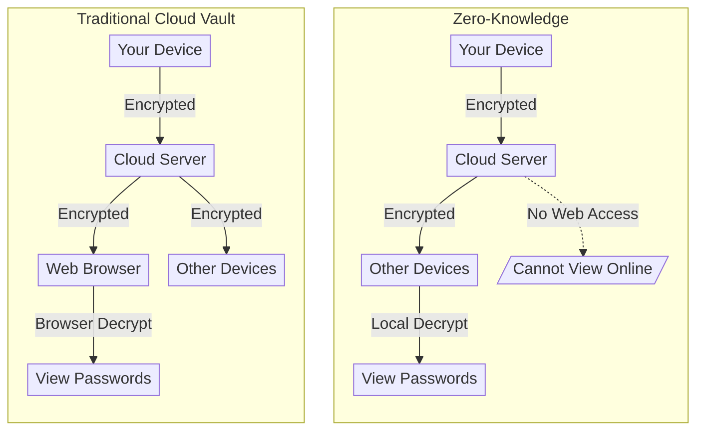

```mermaid
%%{init: {'flowchart': {'nodeSpacing': 20, 'rankSpacing': 30, 'padding': 4}}}%%
flowchart LR
    subgraph Traditional["Traditional Cloud Vault"]
        direction TB
        T1[Your Device] -->|Encrypted| T2[Cloud Server]
        T2 -->|Encrypted| T3[Web Browser]
        T2 -->|Encrypted| T5[Other Devices]
        T3 -->|Browser Decrypt| T4[View Passwords]
    end
    subgraph Sync["Zero-Knowledge"]
        direction TB
        S1[Your Device] -->|Encrypted| S2[Cloud Server]
        S2 -->|Encrypted| S3[Other Devices]
        S2 -.->|No Web Access| S4[/"Cannot View Online"/]
        S3 -->|Local Decrypt| S5[View Passwords]
    end
    Traditional ~~~ Sync
```
