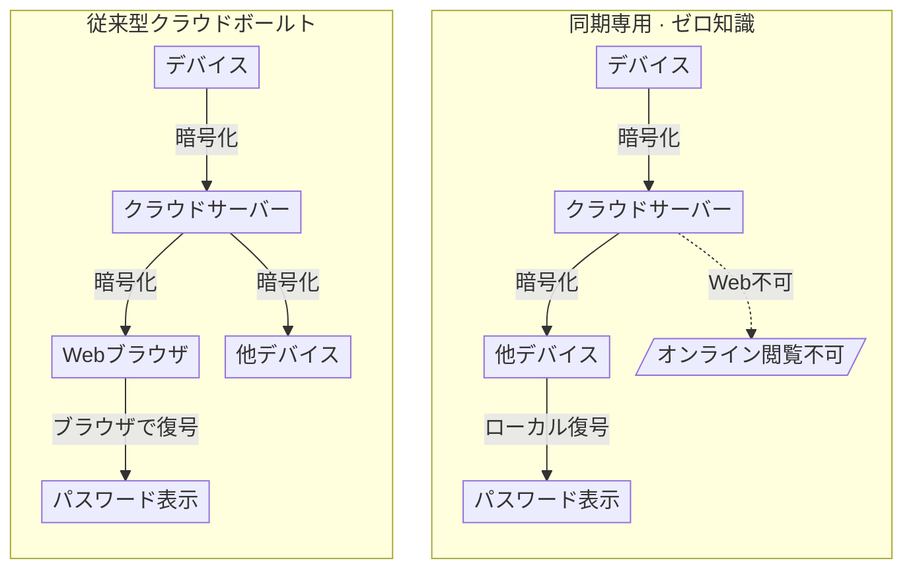

```mermaid
%%{init: {'flowchart': {'nodeSpacing': 20, 'rankSpacing': 30, 'padding': 4}}}%%
flowchart LR
    subgraph Traditional["従来型クラウドボールト"]
        direction TB
        T1[デバイス] -->|暗号化| T2[クラウドサーバー]
        T2 -->|暗号化| T3[Webブラウザ]
        T2 -->|暗号化| T5[他デバイス]
        T3 -->|ブラウザで復号| T4[パスワード表示]
    end
    subgraph Sync["同期専用 · ゼロ知識"]
        direction TB
        S1[デバイス] -->|暗号化| S2[クラウドサーバー]
        S2 -->|暗号化| S3[他デバイス]
        S2 -.->|Web不可| S4[/"オンライン閲覧不可"/]
        S3 -->|ローカル復号| S5[パスワード表示]
    end
    Traditional ~~~ Sync
```
