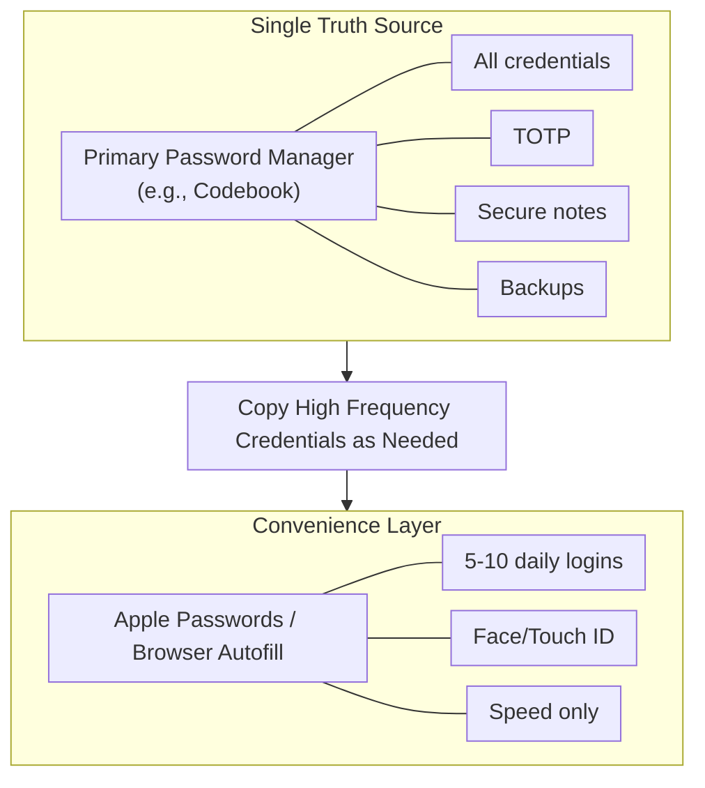

```mermaid
%%{init: {'flowchart': {'nodeSpacing': 15, 'rankSpacing': 30, 'padding': 8}}}%%
flowchart TB
    subgraph Source["Single Truth Source"]
        S1["Primary Password Manager<br/>(e.g., Codebook)"]
        S2["All credentials"] & S3["TOTP"] & S4["Secure notes"] & S5["Backups"]
        S1 --- S2 & S3 & S4 & S5
    end

    subgraph Copy["Copy High Frequency Credentials as Needed"]
        
    end

    subgraph Conv["Convenience Layer"]
        V1["Apple Passwords / Browser Autofill"]
        V2["5-10 daily logins"] & V3["Face/Touch ID"] & V4["Speed only"]
        V1 --- V2 & V3 & V4
    end

    Source --> Copy --> Conv
```
