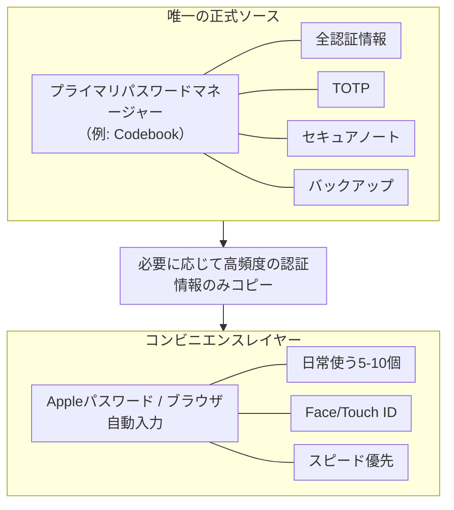

```mermaid
%%{init: {'flowchart': {'nodeSpacing': 15, 'rankSpacing': 30, 'padding': 8}}}%%
flowchart TB
    subgraph Source["唯一の正式ソース"]
        S1["プライマリパスワードマネージャー<br/>（例: Codebook）"]
        S2["全認証情報"] & S3["TOTP"] & S4["セキュアノート"] & S5["バックアップ"]
        S1 --- S2 & S3 & S4 & S5
    end

    subgraph Copy["必要に応じて高頻度の認証情報のみコピー"]
        
    end

    subgraph Conv["コンビニエンスレイヤー"]
        V1["Appleパスワード / ブラウザ自動入力"]
        V2["日常使う5-10個"] & V3["Face/Touch ID"] & V4["スピード優先"]
        V1 --- V2 & V3 & V4
    end

    Source --> Copy --> Conv
```
