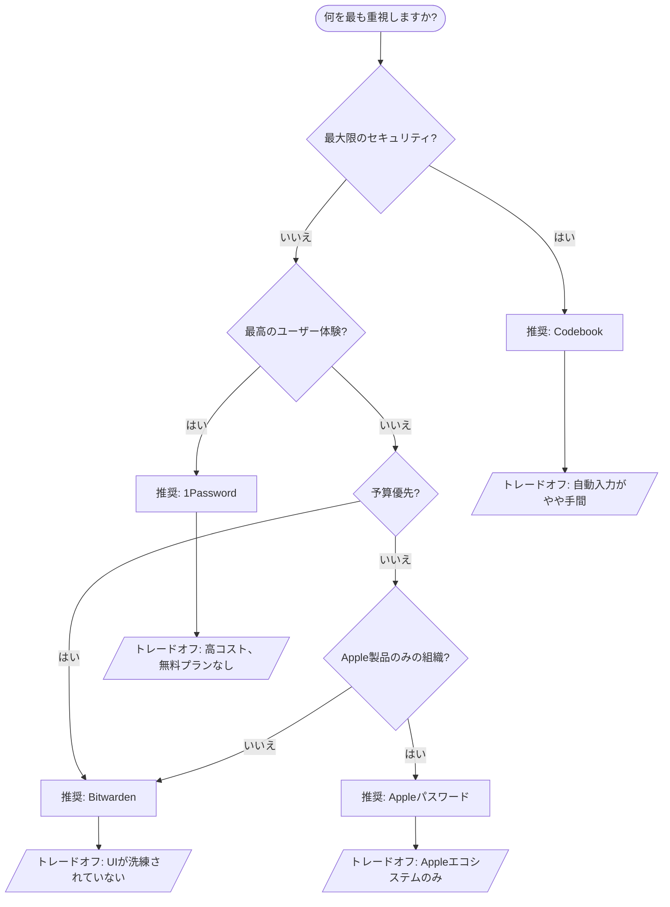

```mermaid
flowchart TD
    Start([何を最も重視しますか?]) --> Q1{最大限のセキュリティ?}
    Q1 -->|はい| Codebook[推奨: Codebook]
    Q1 -->|いいえ| Q2{最高のユーザー体験?}
    Q2 -->|はい| 1Password[推奨: 1Password]
    Q2 -->|いいえ| Q3{予算優先?}
    Q3 -->|はい| Bitwarden[推奨: Bitwarden]
    Q3 -->|いいえ| Q4{Apple製品のみの組織?}
    Q4 -->|はい| Apple[推奨: Appleパスワード]
    Q4 -->|いいえ| Bitwarden

    Codebook --> Note1[/"トレードオフ: 自動入力がやや手間"/]
    1Password --> Note2[/"トレードオフ: 高コスト、無料プランなし"/]
    Bitwarden --> Note3[/"トレードオフ: UIが洗練されていない"/]
    Apple --> Note4[/"トレードオフ: Appleエコシステムのみ"/]
```

Password manager selection flowchart based on priorities
