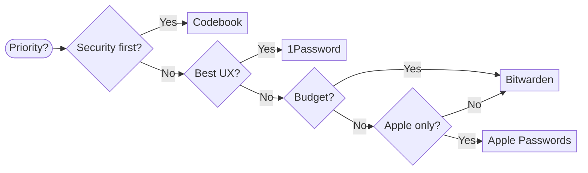

```mermaid
%%{init: {'flowchart': {'nodeSpacing': 10, 'rankSpacing': 20, 'padding': 4}}}%%
flowchart LR
    Start([Priority?]) --> Q1{Security first?}
    Q1 -->|Yes| CB[Codebook]
    Q1 -->|No| Q2{Best UX?}
    Q2 -->|Yes| 1P[1Password]
    Q2 -->|No| Q3{Budget?}
    Q3 -->|Yes| BW[Bitwarden]
    Q3 -->|No| Q4{Apple only?}
    Q4 -->|Yes| AP[Apple Passwords]
    Q4 -->|No| BW
```
