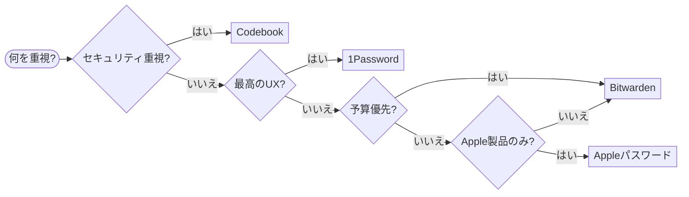

```mermaid
%%{init: {'flowchart': {'nodeSpacing': 10, 'rankSpacing': 20, 'padding': 4}}}%%
flowchart LR
    Start([何を重視?]) --> Q1{セキュリティ重視?}
    Q1 -->|はい| CB[Codebook]
    Q1 -->|いいえ| Q2{最高のUX?}
    Q2 -->|はい| 1P[1Password]
    Q2 -->|いいえ| Q3{予算優先?}
    Q3 -->|はい| BW[Bitwarden]
    Q3 -->|いいえ| Q4{Apple製品のみ?}
    Q4 -->|はい| AP[Appleパスワード]
    Q4 -->|いいえ| BW
```
