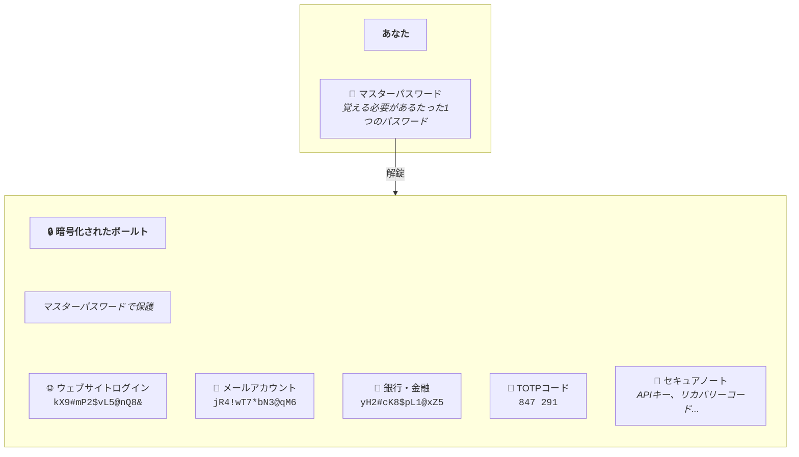

```mermaid
flowchart TB
    subgraph You[" "]
        direction TB
        Y_Title["<b>あなた</b>"]
        MP["🔑 マスターパスワード<br/><i>覚える必要があるたった1つのパスワード</i>"]
        Y_Title ~~~ MP
    end

    subgraph Vault[" "]
        direction TB
        V_Title["<b>🔒 暗号化されたボールト</b>"]
        V_Sub["<i>マスターパスワードで保護</i>"]
        P1["🌐 ウェブサイトログイン<br/><code>kX9#mP2$vL5@nQ8&</code>"]
        P2["📧 メールアカウント<br/><code>jR4!wT7*bN3@qM6</code>"]
        P3["🏦 銀行・金融<br/><code>yH2#cK8$pL1@xZ5</code>"]
        P4["🔢 TOTPコード<br/><code>847 291</code>"]
        P5["📝 セキュアノート<br/><i>APIキー、リカバリーコード...</i>"]
        V_Title ~~~ V_Sub
        V_Sub ~~~ P1
    end

    MP -->|"解錠"| Vault
```

マスターパスワードが暗号化されたボールト内のすべての認証情報を保護
