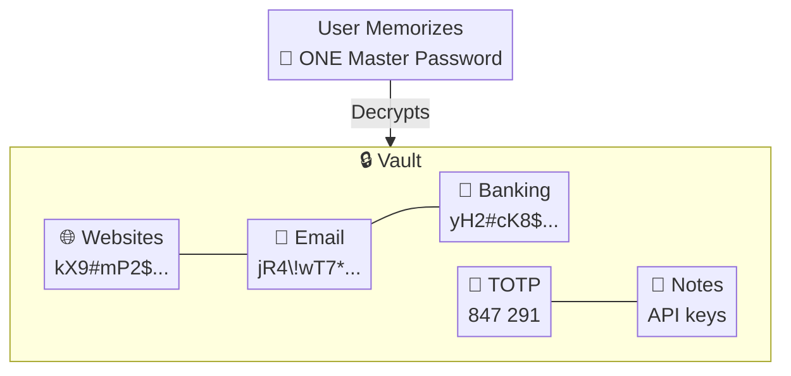

```mermaid
%%{init: {'flowchart': {'nodeSpacing': 20, 'rankSpacing': 30, 'padding': 4}}}%%
flowchart TB
    MP["User Memorizes<br/>🔑 ONE Master Password"]

    subgraph Vault["🔒 Vault"]
        P1["🌐 Websites<br/>kX9#mP2$..."] --- P2["📧 Email<br/>jR4\!wT7*..."] --- P3["🏦 Banking<br/>yH2#cK8$..."]
        P4["🔢 TOTP<br/>847 291"] --- P5["📝 Notes<br/>API keys"]
        P2 ~~~ P4
    end

    MP -->|"Decrypts"| Vault
```
