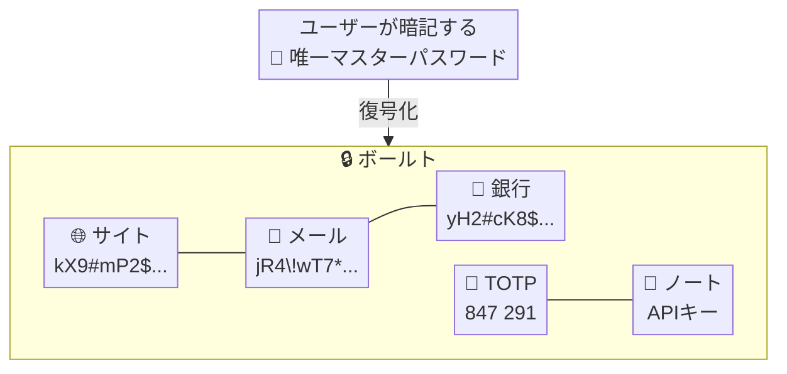

```mermaid
%%{init: {'flowchart': {'nodeSpacing': 20, 'rankSpacing': 30, 'padding': 4}}}%%
flowchart TB
    MP["ユーザーが暗記する<br/>🔑 唯一マスターパスワード"]

    subgraph Vault["🔒 ボールト"]
        P1["🌐 サイト<br/>kX9#mP2$..."] --- P2["📧 メール<br/>jR4\!wT7*..."] --- P3["🏦 銀行<br/>yH2#cK8$..."]
        P4["🔢 TOTP<br/>847 291"] --- P5["📝 ノート<br/>APIキー"]
        P2 ~~~ P4
    end

    MP -->|"復号化"| Vault
```
