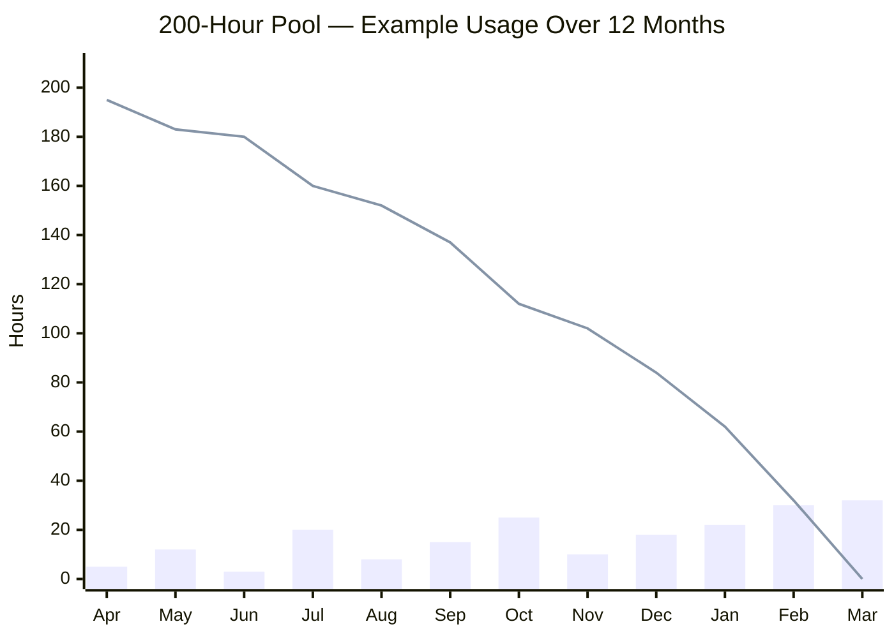

Example of a 200-hour pool consumed over 12 months. Bars show monthly usage (varying from 3 to 32 hours) while the line tracks the declining balance. Usage is uneven — some months are light, others heavy — reflecting real-world demand patterns. The pool is fully consumed by year end. Monthly reporting keeps you informed of remaining hours and projected depletion.
