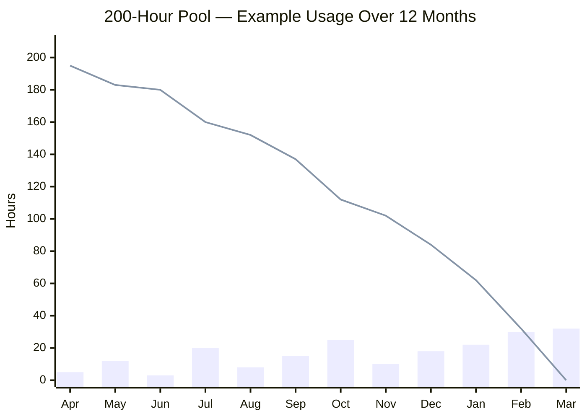

```mermaid
xychart-beta
    title "200-Hour Pool — Example Usage Over 12 Months"
    x-axis ["Apr", "May", "Jun", "Jul", "Aug", "Sep", "Oct", "Nov", "Dec", "Jan", "Feb", "Mar"]
    y-axis "Hours" 0 --> 210
    bar [5, 12, 3, 20, 8, 15, 25, 10, 18, 22, 30, 32]
    line [195, 183, 180, 160, 152, 137, 112, 102, 84, 62, 32, 0]
```

200時間プールの12ヶ月間の消費例。棒グラフは月ごとの使用量（3〜32時間）を示し、折れ線グラフは残高の推移を追跡しています。使用量は均一ではなく、軽い月もあれば多い月もあり、実際の需要パターンを反映しています。プールは年度末までに完全に消費されます。月次レポートにより、残時間と枯渇予測を常に把握できます。
