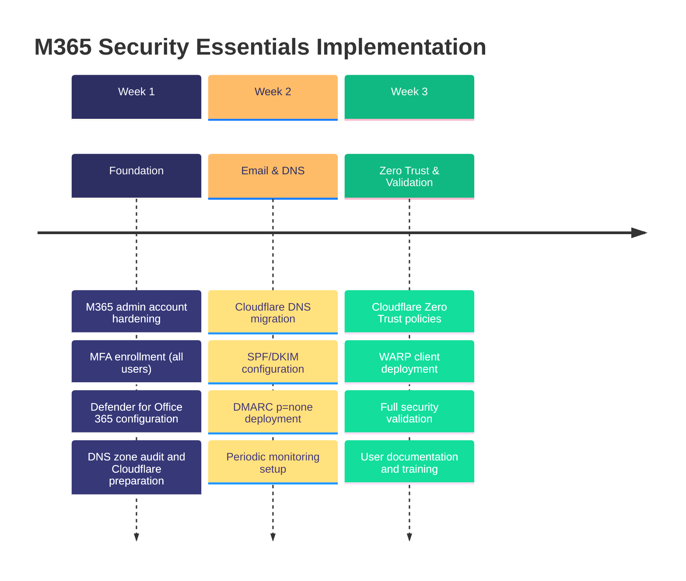

## Implementation Timeline

---

## Pricing

| Component | One-Time Setup | Annual Recurring |
|-----------|---------------|------------------|
| M365 Business Premium (10 users) | — | ¥400,000* |
| M365 Business Premium Hardening | ¥150,000 | — |
| Cloudflare Pro + DNS Migration | ¥100,000 | ¥100,000 |
| Email Security (SPF/DKIM/DMARC) | ¥80,000 | — |
| Cloudflare Zero Trust (Basic) | ¥120,000 | ¥0** |
| Periodic Monitoring (first domain) | — | ¥20,000 |
| **Total** | **¥450,000** | **¥520,000** |

*\* M365 Business Premium subscription*
*\*\* Cloudflare Zero Trust free tier for up to 50 users*
