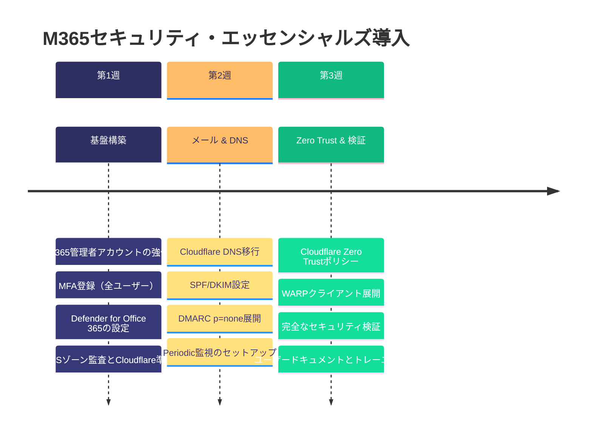

## 導入スケジュール

---

## 料金

| コンポーネント | 初期設定費用 | 年額費用 |
|---------------|-------------|----------|
| M365 Business Premium（10ユーザー） | — | ¥400,000* |
| M365 Business Premiumセキュリティ強化 | ¥150,000 | — |
| Cloudflare Pro + DNS移行 | ¥100,000 | ¥100,000 |
| メールセキュリティ（SPF/DKIM/DMARC） | ¥80,000 | — |
| Cloudflare Zero Trust（基本） | ¥120,000 | ¥0** |
| Periodic監視（最初のドメイン） | — | ¥20,000 |
| **合計** | **¥450,000** | **¥520,000** |

*\* M365 Business Premiumサブスクリプション*
*\*\* Cloudflare Zero Trust無料枠（50ユーザーまで）*
