# Mermaid Diagram Compactness Reference

Quick reference for reducing vertical and horizontal space in Mermaid diagrams.

---

## Flowcharts

### Compact Configuration

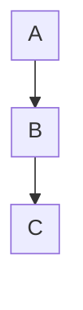

| Property      | Default | Compact | Ultra-compact |
| ------------- | ------- | ------- | ------------- |
| `nodeSpacing` | 50      | 25–30   | 15–20         |
| `rankSpacing` | 50      | 35–40   | 25–30         |
| `padding`     | 8       | 6       | 4             |

### Structural Techniques

**Parallel nodes (same rank):**

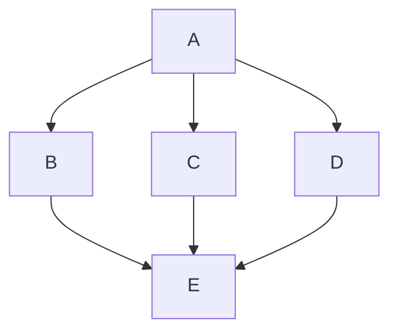

**Horizontal flow (trades height for width):**

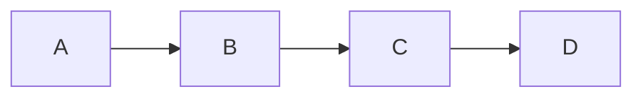

**Invisible links for alignment:**

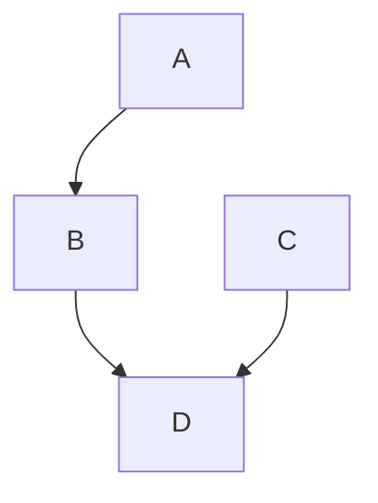

**Collapsed subgraphs:**

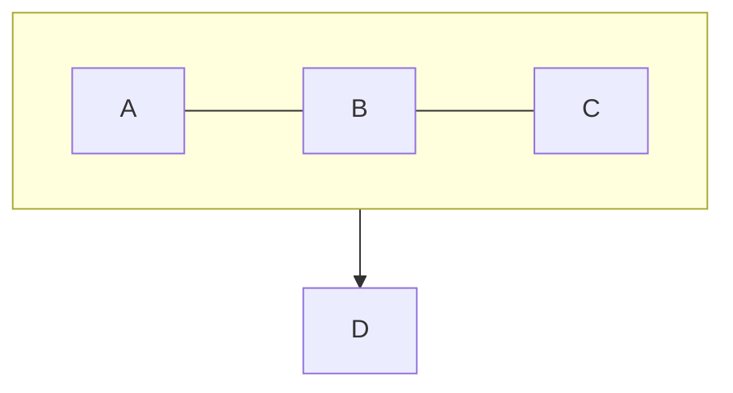

---

## Sequence Diagrams

### Compact Configuration

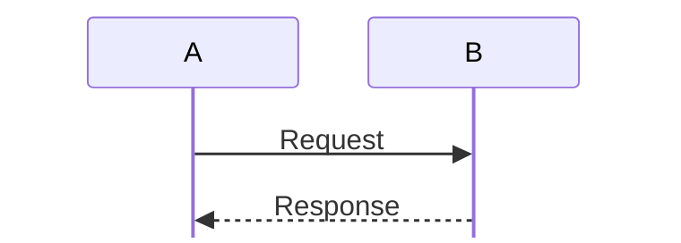

| Property        | Default | Compact | Effect                         |
| --------------- | ------- | ------- | ------------------------------ |
| `messageMargin` | 35      | 15–20   | Vertical gap between messages  |
| `boxMargin`     | 10      | 4–6     | Margin around activation boxes |
| `noteMargin`    | 10      | 6–8     | Space around notes             |
| `actorMargin`   | 50      | 30–40   | Horizontal actor spacing       |
| `mirrorActors`  | true    | false   | Removes bottom actor row       |
| `height`        | 65      | 40–50   | Actor box height               |

### Structural Techniques

**Combine related messages:**

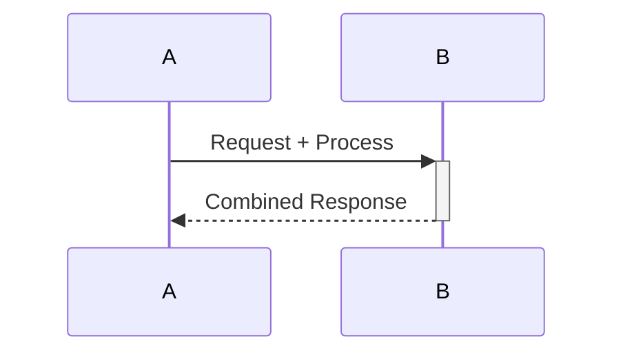

**Use shorter participant aliases:**

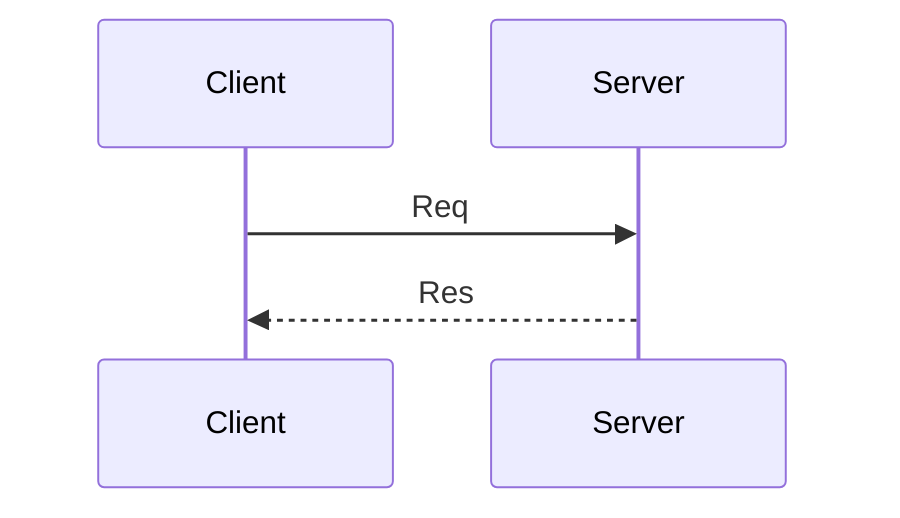

---

## State Diagrams

### Compact Configuration

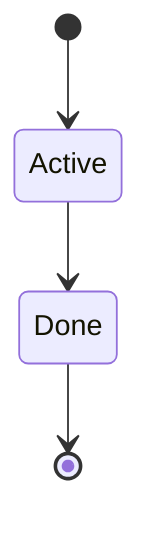

### Structural Techniques

**Horizontal direction:**

```mermaid
stateDiagram-v2
    direction LR
    [*] --> A --> B --> [*]
```

**Composite states for grouping:**

```mermaid
stateDiagram-v2
    direction LR
    state Processing {
        direction LR
        A --> B --> C
    }
    [*] --> Processing --> [*]
```

---

## Entity Relationship Diagrams

### Compact Configuration

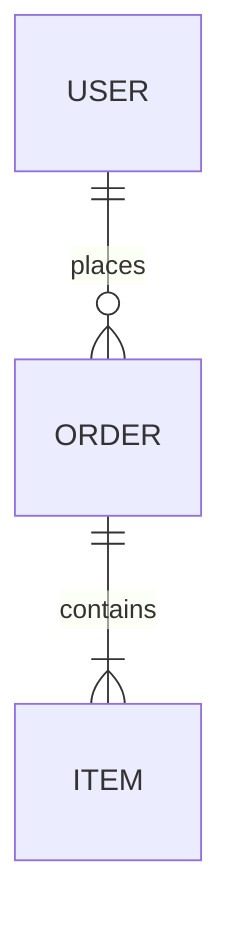

### Structural Techniques

**Shorter entity names and minimal attributes:**

```mermaid
erDiagram
    U[User] ||--o{ O[Order] : places
    O ||--|{ I[Item] : has
```

---

## Class Diagrams

### Compact Configuration

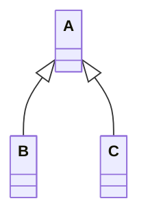

### Structural Techniques

**Horizontal direction:**

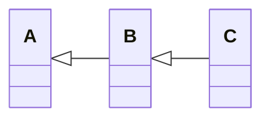

**Abbreviated members:**

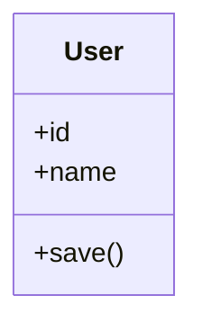

---

## Gantt Charts

### Compact Configuration

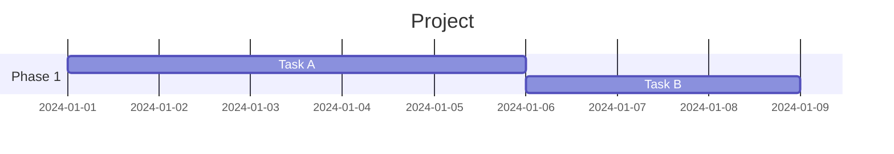

| Property      | Default | Compact | Effect              |
| ------------- | ------- | ------- | ------------------- |
| `barHeight`   | 20      | 12–15   | Height of task bars |
| `barGap`      | 4       | 2–3     | Gap between bars    |
| `leftPadding` | 75      | 50–60   | Label area width    |
| `fontSize`    | 11      | 10–11   | Task label size     |

---

## Pie Charts

### Compact Configuration

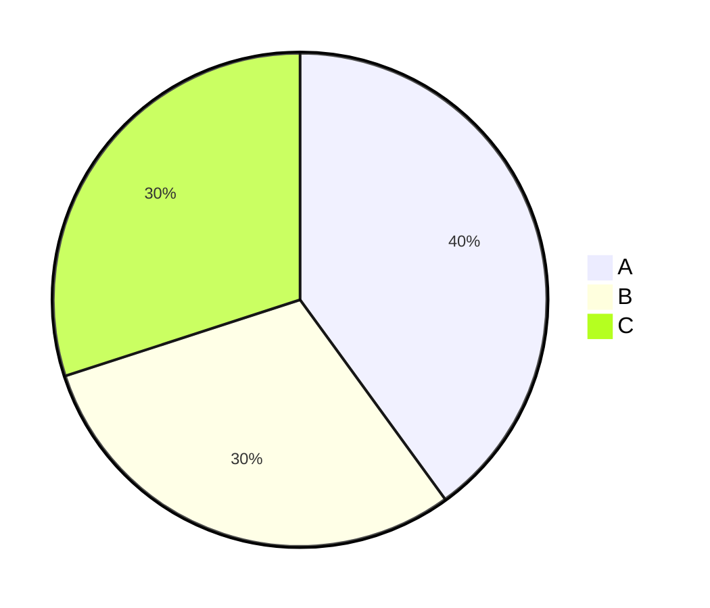

---

## Global Theme Settings

Apply to any diagram type for overall size reduction:

```mermaid
%%{init: {
  'theme': 'base',
  'themeVariables': {
    'fontSize': '12px',
    'fontFamily': 'system-ui'
  }
}}%%
```

| Variable           | Default | Compact | Effect                         |
| ------------------ | ------- | ------- | ------------------------------ |
| `fontSize`         | 16px    | 11–13px | All text smaller               |
| `primaryTextColor` | varies  | —       | Ensure contrast at small sizes |

---

## Copy-Paste Templates

### Ultra-Compact Flowchart

```
%%{init: {'flowchart': {'nodeSpacing': 20, 'rankSpacing': 30, 'padding': 4}}}%%
flowchart TD
```

### Ultra-Compact Sequence

```
%%{init: {'sequence': {'messageMargin': 12, 'boxMargin': 3, 'mirrorActors': false, 'height': 35}}}%%
sequenceDiagram
```

### Ultra-Compact Gantt

```
%%{init: {'gantt': {'barHeight': 12, 'barGap': 2, 'fontSize': 10}}}%%
gantt
```

---

## Troubleshooting

**Diagram still too tall?**

1. Switch from `TD` to `LR` orientation
2. Use `&` to place nodes on same rank
3. Reduce `rankSpacing` further (minimum ~20)
4. Shorten node labels

**Text getting cut off?**

- Increase `padding` slightly
- Use explicit node dimensions: `A[Label]:::wide` with custom class

**Arrows overlapping?**

- Increase `nodeSpacing` while keeping `rankSpacing` low
- Use `curve: 'basis'` for smoother paths

---

## Platform Notes

| Platform   | Config Support | Notes                     |
| ---------- | -------------- | ------------------------- |
| GitHub     | Full           | Works in markdown files   |
| GitLab     | Full           | Works in markdown files   |
| Notion     | Partial        | Some init options ignored |
| Confluence | Limited        | May need plugin           |
| Obsidian   | Full           | Native Mermaid support    |
| VS Code    | Full           | With Mermaid extension    |

---

_Reference version: 1.0_
