# Codex Architecture

This document describes the **current implementation** of the Codex platform. For the full vision including planned features, see [concepts/esolia-codex-architecture-v3.md](./concepts/esolia-codex-architecture-v3.md).

## System Overview

Codex is eSolia's unified knowledge infrastructure providing:
- **Centralized authoring** via Hanawa CMS
- **Semantic search** via Miko (Cloudflare AI Search)
- **Multi-channel publishing** to websites, SharePoint, and secure delivery

```mermaid
flowchart TB
    subgraph Authors["AUTHORING"]
        direction LR
        H["🚀 Hanawa CMS<br/>hanawa.esolia.co.jp"]
        GIT["📁 Git + Claude Code<br/>Technical docs"]
    end

    subgraph Storage["CLOUDFLARE STORAGE"]
        direction TB
        D1[("D1<br/>SQLite")]
        R2[("R2<br/>codex bucket")]
        VEC[("Vectorize<br/>Embeddings")]
        KV[("KV<br/>Cache")]
    end

    subgraph AI["AI LAYER"]
        WAI["Workers AI<br/>Embeddings, Analysis"]
        MIKO["🏮 Miko<br/>AI Search"]
    end

    subgraph Consumers["DISTRIBUTION"]
        HELP["help.esolia.pro"]
        CODEX["codex.esolia.co.jp"]
        SP["SharePoint"]
        PDF["PDF Export"]
        API["Delivery API"]
    end

    H -->|drafts, metadata| D1
    H -->|published content| R2
    GIT -->|sync| R2

    R2 --> VEC
    WAI --> VEC
    VEC --> MIKO

    R2 --> HELP
    R2 --> CODEX
    R2 --> SP
    R2 --> PDF
    D1 --> API
    KV --> API

    style H fill:#e11d48,color:#fff
    style MIKO fill:#2d2f63,color:#fff
```



## Packages

### hanawa-cms (v0.1.0)

The centralized headless CMS deployed at `hanawa.esolia.co.jp`.


**Tech Stack:**
- SvelteKit 2 + Svelte 5 (runes)
- Tailwind CSS v4 + bits-ui
- Tiptap 2.x with custom extensions
- Cloudflare Pages + D1 + R2

**Key Features (Implemented):**
| Feature | Description |
|---------|-------------|
| Rich Text Editor | Tiptap with tables, task lists, code blocks, Mermaid |
| Fragment Library | Reusable content blocks with versioning |
| Version Control | Document history with restore |
| Workflow Engine | Draft → Review → Published states |
| Scheduled Publishing | Time-based publish/unpublish |
| Localization | Field-level EN/JA translations |
| Media Library | R2-backed assets with metadata |
| Webhooks | HMAC-signed event notifications |
| Delivery API | Public content API with caching |
| Preview Links | Shareable token-based previews |
| AI Assistant | Writing suggestions, translation |
| Content Intelligence | Quality scoring, readability |

### hanawa-scheduler (v0.1.0)

Cloudflare Worker handling scheduled publishing jobs.


### pdf-worker (v1.0.0)

Shared PDF generation service for proposals and reports.


## Data Model

### D1 Schema (Core Tables)


### R2 Structure

```
codex/                          # R2 bucket
├── content/                    # Published content
│   ├── concepts/
│   ├── how-to/
│   ├── help/
│   └── blog/
├── fragments/                  # Rendered fragments
├── assets/                     # Media files
│   ├── images/
│   └── documents/
└── exports/                    # Generated PDFs
```

## Security Architecture


**Key Security Controls:**
- Cloudflare Access (Zero Trust authentication)
- XSS prevention via `$lib/sanitize.ts`
- CSRF protection (SvelteKit built-in)
- Content classification (Normal, Confidential, Embargoed)
- Full audit trail logging
- HMAC-signed webhooks

## Content Flow


## API Endpoints

### Content Delivery API

```
GET  /api/v1/content/:collection           # List content
GET  /api/v1/content/:collection/:slug     # Get document
GET  /api/v1/fragments/:id                 # Get fragment
GET  /api/v1/search?q=...                  # Search content
```

### Webhook Events

```
document.created     # New document
document.updated     # Content changed
document.published   # Published to R2
document.unpublished # Removed from R2
fragment.updated     # Fragment changed
```

## Deployment


**URLs:**
| Environment | URL |
|-------------|-----|
| Production | hanawa.esolia.co.jp |
| Preview | {branch}.hanawa-cms.pages.dev |

## Planned Components

| Component | Purpose | Status |
|-----------|---------|--------|
| **Miko Widget** | Embeddable AI search | 🔮 Design complete |
| **codex-sync** | Git → R2 synchronization | 🔮 Planned |
| **Real-time Collab** | Durable Objects + Yjs | ⏳ Specification ready |

---

*Document version: 1.0*
*Last updated: 2025-12-29*
