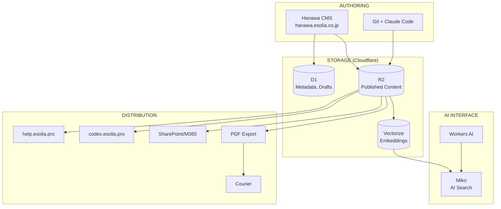

# Codex Documentation

Codex is eSolia's unified knowledge infrastructure—the single source of truth for content, illustrations, and documentation.

## Quick Links

| Document | Description |
|----------|-------------|
| [ARCHITECTURE.md](./ARCHITECTURE.md) | System architecture and what's built |
| [concepts/hanawa-cms.md](./concepts/hanawa-cms.md) | Hanawa CMS technical specification |
| [concepts/miko-ai-search.md](./concepts/miko-ai-search.md) | Miko AI search interface |
| [concepts/hanawa-features/](./concepts/hanawa-features/) | Feature specifications |

## System Overview

## Package Status

| Package | Purpose | Version | Status |
|---------|---------|---------|--------|
| [hanawa-cms](../packages/hanawa-cms/) | Centralized CMS | v0.1.0 | ✅ Released |
| [hanawa-scheduler](../packages/hanawa-scheduler/) | Scheduled publishing | v0.1.0 | ✅ Built |
| [pdf-worker](../packages/pdf-worker/) | PDF generation service | v1.0.0 | ✅ Built |
| miko-widget | AI search widget | - | 🔮 Planned |
| codex-sync | Git → R2 sync | - | 🔮 Planned |

## Feature Implementation Status

Based on [hanawa-features/00-feature-roadmap.md](./concepts/hanawa-features/00-feature-roadmap.md):

| Feature | Spec | Status |
|---------|------|--------|
| Audit System | [01](./concepts/hanawa-features/01-audit-system.md) | ✅ Implemented |
| Version Control | [02](./concepts/hanawa-features/02-version-control.md) | ✅ Implemented |
| Real-time Collaboration | [03](./concepts/hanawa-features/03-realtime-collaboration.md) | ⏳ Planned |
| Comments System | [04](./concepts/hanawa-features/04-comments-system.md) | ✅ Implemented |
| Workflow Engine | [05](./concepts/hanawa-features/05-workflow-engine.md) | ✅ Implemented |
| Scheduled Publishing | [06](./concepts/hanawa-features/06-scheduled-publishing.md) | ✅ Implemented |
| Localization (EN/JA) | [07](./concepts/hanawa-features/07-localization.md) | ✅ Implemented |
| AI Assistant | [08](./concepts/hanawa-features/08-ai-assistant.md) | ✅ Implemented |
| Codex Integration | [09](./concepts/hanawa-features/09-codex-integration.md) | ✅ Implemented |
| Media Library | [10](./concepts/hanawa-features/10-media-library.md) | ✅ Implemented |
| Webhooks | [11](./concepts/hanawa-features/11-webhooks-integrations.md) | ✅ Implemented |
| Editor Productivity | [12](./concepts/hanawa-features/12-editor-productivity.md) | ✅ Implemented |
| Content Intelligence | [13](./concepts/hanawa-features/13-content-intelligence.md) | ✅ Implemented |
| Preview Deployments | [14](./concepts/hanawa-features/14-preview-deployments.md) | ✅ Implemented |
| Delivery API | [15](./concepts/hanawa-features/15-delivery-api.md) | ✅ Implemented |
| Block Editor | [16](./concepts/hanawa-features/16-block-editor.md) | ✅ Implemented |

## Documentation Categories

### Architecture & Design
- [ARCHITECTURE.md](./ARCHITECTURE.md) - Current system architecture
- [concepts/esolia-codex-architecture-v3.md](./concepts/esolia-codex-architecture-v3.md) - Full vision document

### Implementation Guides
- [concepts/hanawa-cms.md](./concepts/hanawa-cms.md) - CMS technical details
- [concepts/cms-content-security.md](./concepts/cms-content-security.md) - Security architecture
- [concepts/fragment-workflow.md](./concepts/fragment-workflow.md) - Fragment lifecycle

### AI & Search
- [concepts/miko-ai-search.md](./concepts/miko-ai-search.md) - Miko implementation
- [concepts/ai-powered-docs-summary.md](./concepts/ai-powered-docs-summary.md) - RAG patterns

### Proposals & Content
- [concepts/proposal-workflow.md](./concepts/proposal-workflow.md) - Proposal assembly
- [concepts/proposal-personalization.md](./concepts/proposal-personalization.md) - Client branding
- [concepts/file-naming-convention.md](./concepts/file-naming-convention.md) - Naming standards

### Shared Standards
- [shared/guides/](./shared/guides/) - Cross-project development guides
- [shared/reference/](./shared/reference/) - Branding, naming conventions

## Security

See [/SECURITY.md](../SECURITY.md) at repo root for:
- Content classification (Normal, Confidential, Embargoed)
- OWASP Top 10 compliance
- Threat model and mitigations
- Audit logging requirements

## Legend

| Symbol | Meaning |
|--------|---------|
| ✅ | Implemented and in production |
| 🔶 | Partially implemented |
| ⏳ | Planned, specification ready |
| 🔮 | Future/exploratory |

---

*Last updated: 2025-12-29*
