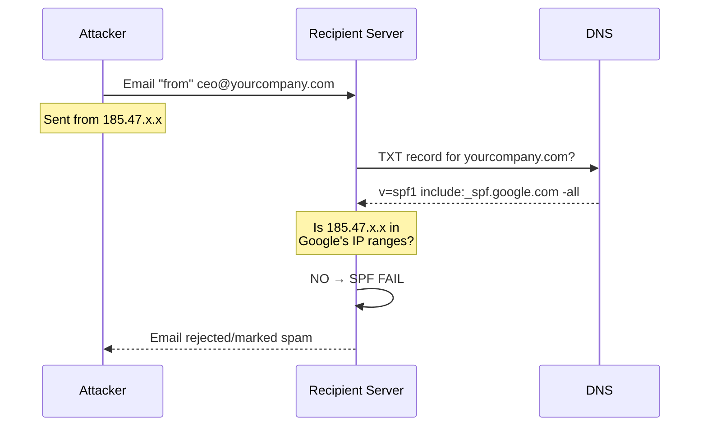

# What is SPF (Sender Policy Framework)?

## Summary

SPF is a DNS-based email authentication method that lets domain owners specify which mail servers are authorized to send email on their behalf. Receiving mail servers check SPF records to detect forged sender addresses.

## The Simple Explanation

Imagine your company has official letterhead that only certain printers are authorized to use. SPF is like publishing a list of those authorized printers so anyone receiving a letter can verify it came from a legitimate source.

When someone receives an email claiming to be from `you@yourcompany.com`, their mail server asks your DNS: "Who is allowed to send email for yourcompany.com?" Your SPF record provides the answer.

## How It Works



### Step by Step

1. **Attacker sends spoofed email** claiming to be from your domain
2. **Recipient's mail server** extracts the domain from the return path
3. **DNS lookup** retrieves your SPF record
4. **IP comparison** checks if the sending server's IP is authorized
5. **Result** determines if email passes, fails, or soft-fails

## SPF Record Anatomy

```
v=spf1 include:_spf.google.com include:mailchimp.com ip4:203.0.113.5 -all
│      │                        │                     │              │
│      │                        │                     │              └─ Reject all others
│      │                        │                     └─ Allow this specific IP
│      │                        └─ Include Mailchimp's authorized servers
│      └─ Include Google Workspace's authorized servers
└─ SPF version 1 (always required)
```

## Mechanisms Explained

| Mechanism | Example | What It Does |
|-----------|---------|--------------|
| `include:` | `include:_spf.google.com` | Trust all IPs authorized by another domain's SPF |
| `ip4:` | `ip4:203.0.113.0/24` | Trust this IPv4 address or CIDR range |
| `ip6:` | `ip6:2001:db8::/32` | Trust this IPv6 address or CIDR range |
| `a` | `a` | Trust IPs in the domain's A record |
| `mx` | `mx` | Trust the domain's mail servers |
| `exists:` | `exists:%{i}.spf.example.com` | Advanced: DNS-based lookup |

## Qualifiers (Results)

| Qualifier | Syntax | Meaning | Recommendation |
|-----------|--------|---------|----------------|
| Pass | `+all` (or just `all`) | Accept everyone | ❌ Never use |
| Fail | `-all` | Reject unauthorized | ✅ Most secure |
| SoftFail | `~all` | Mark suspicious but deliver | ✅ Good default |
| Neutral | `?all` | No opinion | ⚠️ Weak |

## The 10 DNS Lookup Limit

SPF has a critical limitation: **maximum 10 DNS lookups** per check.

Each of these counts as a lookup:
- `include:` (plus nested includes!)
- `a`
- `mx`
- `redirect=`
- `exists:`

**What doesn't count:**
- `ip4:` and `ip6:` (direct IP addresses)
- `all`

If you exceed 10 lookups, SPF returns a permanent error (`permerror`), which most receivers treat as a failure.

### Example Problem

```
v=spf1 include:_spf.google.com       ← 2 lookups (Google has nested includes)
       include:spf.protection.outlook.com  ← 1 lookup
       include:mailchimp.com         ← 1 lookup  
       include:sendgrid.net          ← 1 lookup
       include:amazonses.com         ← 1 lookup
       include:servers.mcsv.net      ← 1 lookup
       include:spf.mtasv.net         ← 1 lookup
       a mx                          ← 2 lookups
       -all
       
Total: 10+ lookups → PERMERROR!
```

## SPF Alone Isn't Enough

SPF has a fundamental limitation: it only validates the **envelope sender** (Return-Path), not the **From header** that users see in their email client.

This means an attacker can:
1. Set a Return-Path to their own domain (passes their SPF)
2. Set the visible From header to your domain
3. Users see an email "from" you, but SPF doesn't catch it

**Solution:** Combine SPF with [DKIM](/concepts/what-is-dkim) and [DMARC](/concepts/what-is-dmarc) for complete protection.

## Common Mistakes

| Mistake | Problem | Fix |
|---------|---------|-----|
| Multiple SPF records | Only first is used, or error | Merge into single record |
| Using `+all` | Authorizes everyone | Use `~all` or `-all` |
| Too many includes | Exceeds lookup limit | Flatten or use IPs |
| Forgetting a service | Legitimate mail fails | Audit all sending services |

## Testing Your SPF

```bash
# Check if SPF record exists
dig TXT yourdomain.com +short | grep spf

# Detailed SPF analysis
nslookup -type=TXT yourdomain.com
```

Online tools:
- [MXToolbox SPF Checker](https://mxtoolbox.com/spf.aspx)
- [SPF Record Testing Tools](https://www.kitterman.com/spf/validate.html)

## Related Topics

- [What is DKIM?](/concepts/what-is-dkim) — Cryptographic email signing
- [What is DMARC?](/concepts/what-is-dmarc) — Policy layer combining SPF + DKIM
- [SPF Missing](/issues/spf-missing) — How to add SPF to your domain
- [SPF Lookup Limit Exceeded](/issues/spf-lookup-limit-exceeded) — Fixing the 10-lookup problem
