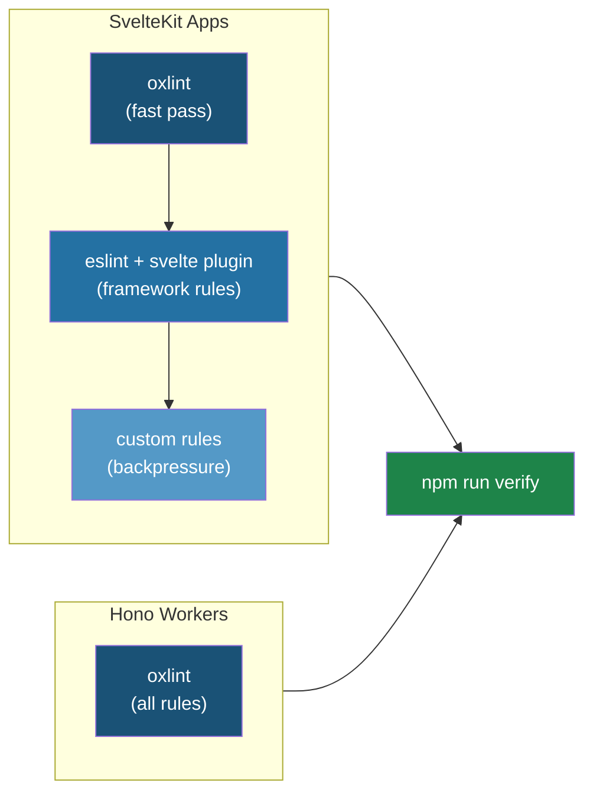

# Linting Strategy: Oxlint + ESLint

> eSolia INTERNAL — Not for distribution outside eSolia

**Applies to:** All SvelteKit and Hono-based Cloudflare Worker projects
**Companion to:** `SVELTEKIT_GUIDE.md`, `SVELTEKIT_BACKPRESSURE.md`
**Last Updated:** February 2026
**Version:** 1.0

---

## Purpose

This guide establishes a two-tier linting strategy across our codebases. The core idea: use oxlint as the fast first pass for universal JavaScript/TypeScript rules, then layer ESLint on top only where framework-specific intelligence is needed.

Think of it as airport security with two checkpoints. Oxlint is the metal detector — fast, catches the obvious stuff, processes everyone in seconds. ESLint with the Svelte plugin is the secondary screening — slower, but understands the nuances of `.svelte` files, runes, template syntax, and component boundaries. For Hono workers (plain TypeScript, no Svelte), the metal detector is all you need.

---

## Architecture overview

The strategy differs by project type because the linting requirements differ:

**SvelteKit apps** need both layers. Oxlint handles the ~200 rules that overlap with ESLint (correctness, suspicious patterns, TypeScript hygiene) at 50–100x the speed. ESLint handles Svelte-specific rules (template validation, rune usage, component patterns) plus our custom backpressure rules that require AST access ESLint provides.

**Hono workers** need only oxlint. These are pure TypeScript — no `.svelte` files, no template syntax, no framework-specific AST. Oxlint covers correctness, TypeScript rules, import validation, and performance patterns natively.



---

## How oxlint and ESLint coexist

The key integration piece is `eslint-plugin-oxlint`. This ESLint plugin automatically disables every ESLint rule that oxlint already covers, preventing duplicate diagnostics. You run oxlint first (fast), then ESLint (slower, but with fewer rules to check).

The plugin provides category-based flat configs that map to oxlint's rule categories: `flat/correctness`, `flat/suspicious`, `flat/pedantic`, `flat/style`, and plugin-based configs like `flat/typescript` and `flat/import`. Place these **last** in your ESLint config array so they override earlier rule definitions.

**The runtime sequence:**

```bash
# oxlint runs first: ~50ms for a typical project
oxlint --config .oxlintrc.json

# eslint runs second: only checks rules oxlint doesn't cover
eslint .
```

In `package.json`, chain them:

```jsonc
{
  "scripts": {
    "lint": "oxlint --config .oxlintrc.json && eslint .",
    "lint:fix": "oxlint --fix --config .oxlintrc.json && eslint --fix ."
  }
}
```

---

## SvelteKit app setup

### Dependencies

```bash
pnpm add -D oxlint eslint-plugin-oxlint eslint eslint-plugin-svelte typescript-eslint globals @eslint/js
```

### `.oxlintrc.json`

Oxlint uses a JSON config (JSONC with comments is supported). For SvelteKit projects, enable the categories that give the most value without conflicting with ESLint's Svelte-specific handling:

```jsonc
{
  "$schema": "https://raw.githubusercontent.com/nicolo-ribaudo/oxlint-config-schema/main/schema.json",
  "categories": {
    "correctness": "error",
    "suspicious": "warn",
    "perf": "warn"
  },
  "plugins": ["typescript", "import", "unicorn", "promise"],
  "rules": {
    // Disable rules that conflict with Svelte patterns
    // $state, $derived, $props look like unused vars to oxlint
    "no-unused-vars": "off",
    "@typescript-eslint/no-unused-vars": "off",

    // Svelte components use PascalCase imports that aren't "used" in script
    "import/no-unused-modules": "off",

    // Enable high-value rules explicitly
    "no-console": "warn",
    "no-debugger": "error",
    "eqeqeq": "error",
    "no-var": "error",
    "prefer-const": "error",
    "@typescript-eslint/no-explicit-any": "warn",
    "@typescript-eslint/no-non-null-assertion": "warn",

    // Promise handling
    "promise/no-nesting": "warn",
    "promise/no-return-wrap": "error",

    // Unicorn quality rules
    "unicorn/no-array-for-each": "warn",
    "unicorn/prefer-node-protocol": "error"
  },
  "ignorePatterns": [
    "build/",
    ".svelte-kit/",
    "dist/",
    "node_modules/",
    ".wrangler/",
    "**/*.config.js",
    "**/*.config.ts"
  ],
  "overrides": [
    {
      "files": ["*.svelte"],
      "rules": {
        // Relax rules that oxlint can't fully understand in .svelte files
        // ESLint + svelte plugin handles these instead
        "no-undef": "off"
      }
    }
  ]
}
```

**Why disable `no-unused-vars` in oxlint?** Svelte 5 runes like `$state()`, `$derived()`, and `$props()` create reactive bindings that are consumed in the template markup. Oxlint only sees the `<script>` block and flags these as unused. The Svelte ESLint plugin understands the full component and handles this correctly.

### `eslint.config.js`

This is the full flat config for SvelteKit apps. It extends the current pattern from Courier/Pulse/Periodic and adds the oxlint integration layer plus custom backpressure rules:

```javascript
import js from '@eslint/js';
import ts from 'typescript-eslint';
import svelte from 'eslint-plugin-svelte';
import globals from 'globals';
import oxlint from 'eslint-plugin-oxlint';
import { noRawHtml } from './eslint-rules/no-raw-html.js';
import { noBindingLeak } from './eslint-rules/no-binding-leak.js';
import { noSchemaParse } from './eslint-rules/no-schema-parse.js';
import { noSilentCatch } from './eslint-rules/no-silent-catch.js';

// Custom backpressure rules plugin
const esoliaPlugin = {
  meta: { name: 'eslint-plugin-esolia', version: '1.0.0' },
  rules: {
    'no-raw-html': noRawHtml,
    'no-binding-leak': noBindingLeak,
    'no-schema-parse': noSchemaParse,
    'no-silent-catch': noSilentCatch
  }
};

export default ts.config(
  // Base configs
  js.configs.recommended,
  ...ts.configs.recommended,
  ...svelte.configs['flat/recommended'],

  // Global settings
  {
    languageOptions: {
      globals: {
        ...globals.browser,
        ...globals.node
      }
    },
    plugins: {
      esolia: esoliaPlugin
    },
    rules: {
      // Unused vars: let eslint handle this (not oxlint) for Svelte awareness
      '@typescript-eslint/no-unused-vars': [
        'error',
        {
          argsIgnorePattern: '^_',
          varsIgnorePattern: '^_',
          caughtErrorsIgnorePattern: '^_',
          destructuredArrayIgnorePattern: '^_'
        }
      ],

      // Backpressure rules (from SVELTEKIT_BACKPRESSURE.md)
      'esolia/no-raw-html': 'error',
      'esolia/no-binding-leak': 'error',
      'esolia/no-schema-parse': 'warn',
      'esolia/no-silent-catch': 'error'
    }
  },

  // Svelte file handling
  {
    files: ['**/*.svelte'],
    languageOptions: {
      parserOptions: {
        parser: ts.parser
      }
    }
  },

  // Server-only files: enable stricter rules
  {
    files: ['**/*.server.ts', '**/server/**/*.ts', '**/hooks.*.ts'],
    rules: {
      // Server files should never use browser globals
      'no-restricted-globals': ['error', 'window', 'document', 'localStorage', 'sessionStorage']
    }
  },

  // Test files: relax some rules
  {
    files: ['**/*.test.ts', '**/*.spec.ts', '**/tests/**'],
    rules: {
      '@typescript-eslint/no-explicit-any': 'off',
      'esolia/no-silent-catch': 'off'
    }
  },

  // Ignores
  {
    ignores: ['build/', '.svelte-kit/', 'dist/', 'node_modules/', '.wrangler/']
  },

  // Oxlint compat: MUST be last — disables rules oxlint already covers
  oxlint.configs['flat/recommended']
);
```

### `package.json` scripts

```jsonc
{
  "scripts": {
    "lint": "oxlint --config .oxlintrc.json && eslint .",
    "lint:fix": "oxlint --fix --config .oxlintrc.json && eslint --fix .",
    "check": "svelte-kit sync && svelte-check --tsconfig ./tsconfig.json",
    "test:unit": "vitest run",
    "verify": "npm run lint && npm run check && npm run test:unit",
    "format": "prettier --write .",
    "format:check": "prettier --check ."
  }
}
```

The `verify` script chains all deterministic checks. This is the command Claude Code runs after generating anything, and the command CI gates on.

---

## Hono worker setup

### Dependencies

```bash
npm install -D oxlint
```

That's it. No ESLint, no plugin ecosystem, no parser configuration. For pure TypeScript workers, oxlint handles everything.

### `.oxlintrc.json`

Hono workers get a stricter configuration since there are no framework quirks to work around:

```jsonc
{
  "$schema": "https://raw.githubusercontent.com/nicolo-ribaudo/oxlint-config-schema/main/schema.json",
  "categories": {
    "correctness": "error",
    "suspicious": "warn",
    "pedantic": "warn",
    "perf": "warn"
  },
  "plugins": ["typescript", "import", "unicorn", "promise", "node"],
  "rules": {
    // Strict TypeScript
    "@typescript-eslint/no-explicit-any": "error",
    "@typescript-eslint/no-non-null-assertion": "warn",
    "@typescript-eslint/no-unused-vars": [
      "error",
      {
        "argsIgnorePattern": "^_",
        "varsIgnorePattern": "^_",
        "caughtErrorsIgnorePattern": "^_"
      }
    ],

    // Code quality
    "no-console": "warn",
    "no-debugger": "error",
    "eqeqeq": "error",
    "no-var": "error",
    "prefer-const": "error",

    // Promise handling (critical for Workers)
    "promise/no-nesting": "warn",
    "promise/no-return-wrap": "error",

    // Import hygiene
    "import/no-duplicates": "error",

    // Unicorn quality
    "unicorn/no-array-for-each": "warn",
    "unicorn/prefer-node-protocol": "error",
    "unicorn/no-null": "off",
    "unicorn/prefer-top-level-await": "off"
  },
  "ignorePatterns": ["dist/", "node_modules/", ".wrangler/", "**/*.config.js", "**/*.config.ts"]
}
```

**Why `pedantic` for Hono but not SvelteKit?** Pedantic rules are stricter and occasionally produce false positives. In pure TypeScript, these false positives are rare. In `.svelte` files, oxlint's partial template understanding would generate too much noise at the pedantic level.

### `package.json` scripts

```jsonc
{
  "scripts": {
    "lint": "oxlint --config .oxlintrc.json",
    "lint:fix": "oxlint --fix --config .oxlintrc.json",
    "typecheck": "tsc --noEmit",
    "verify": "npm run lint && npm run typecheck",
    "format": "prettier --write .",
    "format:check": "prettier --check ."
  }
}
```

---

## Custom ESLint rules (backpressure enforcement)

These rules implement the mechanical enforcement described in `SVELTEKIT_BACKPRESSURE.md`. They live in an `eslint-rules/` directory at the project root and are registered as a local plugin in `eslint.config.js`.

Each rule targets a specific class of mistake that AI code generation commonly produces. The rules are intentionally simple — they pattern-match on AST nodes rather than attempting deep semantic analysis.

**Phase 1 scope:** This guide implements four rules. Two additional rules from the backpressure guide — `no-raw-db-prepare` (tenant isolation) and `no-plain-error-throw` (error classification) — are planned for Phase 2 once the tenant context helpers from `SVELTEKIT_BACKPRESSURE.md § Tenant isolation` are in place across repos.

### `no-raw-html`

Catches `{@html expr}` without a `sanitizeHtml()` wrapper. Maps to the XSS prevention requirements in `SVELTEKIT_GUIDE.md § XSS Prevention`.

**Scope note:** This rule addresses template injection via `{@html}`. The separate CVE-2025-15265 vulnerability (object key injection with `hydratable: true`) is handled through type-level constraints — using fixed object keys or whitelist validation — rather than linting. See `SVELTEKIT_GUIDE.md § Object Key Injection` for details.

```javascript
// eslint-rules/no-raw-html.js
export const noRawHtml = {
  meta: {
    type: 'problem',
    docs: {
      description: 'Disallow {@html} without sanitizeHtml() wrapper'
    },
    messages: {
      unsanitized:
        'Raw HTML rendering detected. Wrap with sanitizeHtml() or nlToBr() from $lib/sanitize. See SVELTEKIT_GUIDE.md § XSS Prevention.'
    },
    schema: []
  },
  create(context) {
    // This rule works on .svelte files parsed by eslint-plugin-svelte
    return {
      SvelteRawMustacheTag(node) {
        const expr = node.expression;

        // Allow: {@html sanitizeHtml(x)} or {@html nlToBr(x)}
        if (
          expr.type === 'CallExpression' &&
          expr.callee.type === 'Identifier' &&
          ['sanitizeHtml', 'nlToBr'].includes(expr.callee.name)
        ) {
          return;
        }

        context.report({ node, messageId: 'unsanitized' });
      }
    };
  }
};
```

### `no-binding-leak`

Catches `platform.env.*` references in load function return statements. Cloudflare bindings (D1, R2, KV) are non-serializable objects that must never be sent to the client.

```javascript
// eslint-rules/no-binding-leak.js
export const noBindingLeak = {
  meta: {
    type: 'problem',
    docs: {
      description: 'Disallow returning platform.env bindings from load functions'
    },
    messages: {
      bindingLeak:
        'Do not return platform.env bindings to the client. Query the binding and return the data instead. See SVELTEKIT_GUIDE.md § Cloudflare Integration.'
    },
    schema: []
  },
  create(context) {
    // Only apply to load function files
    const filename = context.getFilename();
    if (!filename.match(/\+(page|layout)\.server\.(ts|js)$/)) {
      return {};
    }

    return {
      ReturnStatement(node) {
        if (!node.argument || node.argument.type !== 'ObjectExpression') return;

        for (const prop of node.argument.properties) {
          if (prop.type !== 'Property') continue;

          const value = prop.value;
          // Catch: { db: platform.env.DB } or { bucket: event.platform.env.ASSETS }
          if (
            value.type === 'MemberExpression' &&
            context.getSourceCode().getText(value).includes('platform.env')
          ) {
            context.report({ node: prop, messageId: 'bindingLeak' });
          }
        }
      }
    };
  }
};
```

### `no-schema-parse`

Enforces `safeParse()` over `parse()` for Zod schemas. `parse()` throws uncontrolled errors; `safeParse()` returns a result object that forces explicit error handling.

```javascript
// eslint-rules/no-schema-parse.js
export const noSchemaParse = {
  meta: {
    type: 'suggestion',
    docs: {
      description: 'Prefer safeParse() over parse() for schema validation'
    },
    messages: {
      useSafeParse:
        'Use .safeParse() instead of .parse() for explicit error handling. If you intentionally want to throw, rename to .unsafeParse() or add a suppression comment. See SVELTEKIT_BACKPRESSURE.md § Layer 1.'
    },
    schema: []
  },
  create(context) {
    return {
      CallExpression(node) {
        if (
          node.callee.type === 'MemberExpression' &&
          node.callee.property.type === 'Identifier' &&
          node.callee.property.name === 'parse'
        ) {
          // Heuristic: if the object looks like a schema (ends with Schema, or
          // is a chained zod call like z.object(...).parse()), flag it.
          const objText = context.getSourceCode().getText(node.callee.object);
          if (
            objText.match(/Schema$/i) ||
            objText.match(/^z\./) ||
            objText.match(/\.object\(/) ||
            objText.match(/\.string\(/) ||
            objText.match(/\.array\(/)
          ) {
            context.report({ node: node.callee.property, messageId: 'useSafeParse' });
          }
        }
      }
    };
  }
};
```

### `no-silent-catch`

Catches empty `catch {}` blocks that silently swallow errors. These hide bugs and make debugging impossible.

```javascript
// eslint-rules/no-silent-catch.js
export const noSilentCatch = {
  meta: {
    type: 'problem',
    docs: {
      description: 'Disallow empty catch blocks that swallow errors'
    },
    messages: {
      silentCatch:
        'Empty catch block silently swallows errors. Log the error, rethrow, or handle it explicitly.'
    },
    schema: []
  },
  create(context) {
    return {
      CatchClause(node) {
        if (node.body.type === 'BlockStatement' && node.body.body.length === 0) {
          context.report({ node, messageId: 'silentCatch' });
        }
      }
    };
  }
};
```

### Rule file structure

Place these in the project root under `eslint-rules/`:

```
project-root/
├── eslint-rules/
│   ├── no-raw-html.js
│   ├── no-binding-leak.js
│   ├── no-schema-parse.js
│   └── no-silent-catch.js
├── eslint.config.js
├── .oxlintrc.json
└── package.json
```

Future: package these as `eslint-plugin-esolia-sveltekit` (Phase 4 of the backpressure implementation plan) so they can be installed from npm across all repos.

---

## Migration steps for existing repos

### SvelteKit repos (Courier, Pulse, Periodic, JAC-2026)

1. Install dependencies:

```bash
pnpm add -D oxlint eslint-plugin-oxlint
```

2. Create `.oxlintrc.json` using the SvelteKit template above.

3. Update `eslint.config.js` to add the oxlint compat layer at the end:

```javascript
import oxlint from 'eslint-plugin-oxlint';

// ... existing config ...

export default ts.config(
  // ... existing entries ...

  // Add this as the LAST entry
  oxlint.configs['flat/recommended']
);
```

4. Copy `eslint-rules/` directory for backpressure rules.

5. Update `package.json` scripts:

```bash
# Replace the lint script
# Before: "lint": "eslint ."
# After:
"lint": "oxlint --config .oxlintrc.json && eslint ."
```

6. Add the `verify` script if it doesn't exist:

```bash
"verify": "npm run lint && npm run check && npm run test:unit"
```

7. Run and fix: `pnpm run lint` — expect some new warnings from oxlint's `suspicious` and `perf` categories. Address or suppress as appropriate.

### Hono repos (Nexus, CFDX, PDF Worker, Cogley API)

1. Install oxlint:

```bash
npm install -D oxlint
```

2. Create `.oxlintrc.json` using the Hono template above.

3. Remove ESLint if present (Nexus currently has it):

```bash
npm uninstall eslint @eslint/js typescript-eslint globals
rm eslint.config.js
```

4. Update `package.json` scripts:

```jsonc
{
  "scripts": {
    "lint": "oxlint --config .oxlintrc.json",
    "typecheck": "tsc --noEmit",
    "verify": "npm run lint && npm run typecheck"
  }
}
```

5. Run and fix: `npm run lint`.

---

## CI integration

Add a verification step to your GitHub Actions workflow that runs the same `verify` script:

```yaml
# .github/workflows/verify.yml
name: Verify
on: [push, pull_request]

jobs:
  verify:
    runs-on: ubuntu-latest
    steps:
      - uses: actions/checkout@v4

      - uses: actions/setup-node@v4
        with:
          node-version: '22'

      # For pnpm repos (SvelteKit)
      - uses: pnpm/action-setup@v4
        if: hashFiles('pnpm-lock.yaml') != ''
        with:
          version: latest

      - run: npm ci || pnpm install --frozen-lockfile
      - run: npm run verify
```

The workflow is the same regardless of whether the repo uses oxlint alone or oxlint + ESLint — the `verify` script abstracts the difference.

---

## Why not just oxlint everywhere?

A reasonable question. Oxlint is faster and simpler. Three reasons ESLint stays for SvelteKit:

**Template awareness.** The `eslint-plugin-svelte` parser understands `.svelte` files as a whole — script, template, and style blocks together. It knows that a variable declared in `<script>` and used in `{#each items as item}` is not unused. Oxlint parses only the script block and lacks this cross-block understanding.

**Runes intelligence.** Svelte 5 runes (`$state`, `$derived`, `$props`, `$effect`) have specific semantics that the Svelte ESLint plugin validates: correct usage patterns, reactivity tracking, binding declarations. Oxlint treats these as regular function calls and misses incorrect usage.

**Custom rule AST.** Our backpressure rules (no-raw-html, no-binding-leak, etc.) rely on ESLint's AST visitor API. Oxlint has a plugin API but it's still maturing. For now, complex custom rules are more reliable in ESLint.

The tradeoff is explicit: we accept ESLint's slower speed in SvelteKit projects because it provides capabilities oxlint doesn't yet offer for Svelte. For Hono workers, where none of these concerns apply, oxlint alone is the right tool.

---

## Oxlint rule categories reference

For tuning your `.oxlintrc.json`:

| Category      | Default | What it catches                          | Recommended                             |
| ------------- | ------- | ---------------------------------------- | --------------------------------------- |
| `correctness` | On      | Code that is outright wrong or useless   | `error` everywhere                      |
| `suspicious`  | Off     | Code that is most likely wrong           | `warn` everywhere                       |
| `pedantic`    | Off     | Strict rules, occasional false positives | `warn` for Hono, off for SvelteKit      |
| `perf`        | Off     | Suboptimal patterns                      | `warn` everywhere                       |
| `style`       | Off     | Non-idiomatic patterns                   | Off (let Prettier handle style)         |
| `restriction` | Off     | Prevents certain language features       | Off (too opinionated for most projects) |
| `nursery`     | Off     | New/experimental rules                   | Off in production                       |

---

## Connection to backpressure layers

This linting setup maps directly to Layer 2 of the verification pyramid from `SVELTEKIT_BACKPRESSURE.md`:

| Backpressure layer     | Implementation                                                         |
| ---------------------- | ---------------------------------------------------------------------- |
| Type system (Layer 1)  | `tsconfig.json` with `strict: true`, Zod schemas, discriminated unions |
| **Linting (Layer 2)**  | **oxlint (universal rules) + ESLint (Svelte + custom rules)**          |
| Tests (Layer 3)        | vitest (unit), Playwright (E2E)                                        |
| Self-verification loop | `npm run verify` chains all layers                                     |

The `verify` script is the single command that chains Layers 1–3 into one deterministic gate. Claude Code runs it after generating code. CI runs it on every push. The human enters the review loop only after all three layers pass.

---

## Document info

**Version**: 1.0
**Maintainer**: eSolia Inc.
**Applies to**: All SvelteKit and Hono-based projects

### Changelog

- **1.0 (Feb 2026)**: Initial version — oxlint + ESLint dual-layer strategy for SvelteKit, oxlint-only for Hono workers, custom backpressure rule implementations, migration steps, CI integration

---

## Contact

**eSolia Inc.**
Shiodome City Center 5F (Work Styling)
1-5-2 Higashi-Shimbashi, Minato-ku, Tokyo, Japan 105-7105
**Tel (Main):** +813-4577-3380
**Web:** https://esolia.co.jp/en
**Preparer:** rick.cogley@esolia.co.jp
