# Engineering Backpressure for SvelteKit Code Quality

> eSolia INTERNAL — Not for distribution outside eSolia

**Applies to:** All SvelteKit + Svelte 5 projects using Claude Code or other AI coding assistants  
**Companion to:** `SVELTEKIT_GUIDE.md`, `CLAUDE_PROJECT_TEMPLATE.md`  
**Inspired by:** [If you don't engineer backpressure, you'll get slopped](https://jw.hn/engineering-backpressure) (JW, Feb 2025)

---

## Purpose

This guide translates the _backpressure_ concept from distributed systems into a concrete quality enforcement strategy for our SvelteKit projects. The core principle: **don't inspect AI output line by line — engineer constraints that make bad output structurally impossible.**

In distributed systems, backpressure prevents an upstream producer from flooding a downstream consumer. AI code generation has the same dynamic: high-volume output, variable quality, and a human bottleneck at the review stage. The fix is identical — push enforcement upstream into deterministic layers that run automatically.

This document covers what to enforce, where to enforce it, and how each layer maps to our existing SvelteKit toolchain.

---

## The verification pyramid

Quality enforcement follows a strict hierarchy. Each layer is deterministic (same input → same result) except the final one, which requires judgment.

```mermaid
%%{init: {'flowchart': {'curve': 'basis'}}}%%
flowchart TB
    A["🔷 Agentic Review\n(judgment, ~10%)"] --> B
    B["🧪 E2E Tests\n(real user flows)"] --> C
    C["🔗 Integration Tests\n(components together)"] --> D
    D["📋 Contract Tests\n(external API shape)"] --> E
    E["✅ Unit Tests\n(isolated logic)"] --> F
    F["🔍 Linting + Custom Rules\n(pattern enforcement)"] --> G
    G["🛡️ Type System\n(structural guarantees, ~90%)"]

    style G fill:#1a5276,color:#fff,stroke:#154360
    style F fill:#1f618d,color:#fff,stroke:#1a5276
    style E fill:#2471a3,color:#fff,stroke:#1f618d
    style D fill:#2980b9,color:#fff,stroke:#2471a3
    style C fill:#5499c7,color:#fff,stroke:#2980b9
    style B fill:#7fb3d8,color:#1a5276,stroke:#5499c7
    style A fill:#a9cce3,color:#1a5276,stroke:#7fb3d8
```



**The ratio matters.** Deterministic layers (types through E2E tests) should catch approximately 90% of problems. Agentic review handles the remaining 10% that requires context and reasoning. If you find yourself relying on manual or AI-assisted code review for things that _could_ be checked deterministically, you're building on sand.

---

## Layer 1: Type system — the narrowest corridor

Types are your strongest constraint. When types are strict, AI-generated code walks a narrow corridor where deviation becomes structurally impossible.

### Tighten `app.d.ts`

Use discriminated unions to force handling of unauthenticated states rather than relying on null checks that are easy to forget:

```typescript
// src/app.d.ts

// ❌ Weak: null is easy to forget to check
interface Locals {
  user: User | null;
}

// ✅ Strong: forces exhaustive handling at every access point
interface Locals {
  auth: { authenticated: true; user: User } | { authenticated: false; user: null };
}
```

### Validate at boundaries, not inline

Raw D1 queries return `unknown`. The temptation — especially for AI — is to cast with `as`. Instead, validate with Zod at the data boundary so everything downstream has guaranteed shape:

```typescript
// src/lib/server/db.ts
import { z } from 'zod';

const UserSchema = z.object({
  id: z.string(),
  org_id: z.string(),
  email: z.string().email(),
  role: z.enum(['admin', 'member']),
});

type User = z.infer<typeof UserSchema>;

// ❌ Casting: trusts the shape blindly
const user = (await db.prepare('SELECT * FROM users WHERE id = ?').bind(id).first()) as User;

// ✅ Parsing: fails loud if the shape is wrong
const row = await db.prepare('SELECT * FROM users WHERE id = ?').bind(id).first();
const user = UserSchema.parse(row);
```

**Prefer `safeParse` over `parse` in form actions and API routes.** `parse()` throws an uncontrolled error. `safeParse()` returns a result object that forces you to handle the error case — the same principle that drives the custom ESLint rule `no-schema-parse` described later.

```typescript
// +page.server.ts — form action
export const actions = {
  default: async ({ request }) => {
    const formData = await request.formData();
    const result = InputSchema.safeParse(Object.fromEntries(formData));

    if (!result.success) {
      return fail(400, { errors: result.error.flatten().fieldErrors });
    }

    // result.data is fully typed from here
    await saveRecord(result.data);
    return { success: true };
  },
};
```

### Use `satisfies` for load function returns

TypeScript's `satisfies` operator validates that a value matches a type without widening it. Use it on load function return values to catch shape mismatches at compile time:

```typescript
// +page.server.ts
import type { PageServerLoad } from './$types';

interface DashboardData {
  user: User;
  items: Item[];
  stats: { total: number; active: number };
}

export const load: PageServerLoad = async ({ locals, platform }) => {
  const db = platform.env.DB;
  // ...
  return {
    user,
    items,
    stats: { total, active },
  } satisfies DashboardData;
};
```

---

## Layer 2: Linting — encoded institutional memory

Every mistake you keep correcting should become a rule. A lint rule that fires on every save is worth more than a paragraph in CLAUDE.md that an AI might ignore.

### SvelteKit-specific custom rules

These target the most common AI mistakes in our codebase. Implement as custom ESLint rules in a shared plugin or as inline rule definitions in your ESLint config.

| Rule name              | What it catches                                                    | Rationale                                                                                  |
| ---------------------- | ------------------------------------------------------------------ | ------------------------------------------------------------------------------------------ |
| `no-raw-html`          | `{@html expr}` without `sanitizeHtml()` wrapper                    | XSS prevention; maps to SVELTEKIT_GUIDE security requirements                              |
| `no-binding-leak`      | `platform.env.*` in load function return statements                | Bindings are non-serializable and expose server internals                                  |
| `no-raw-db-prepare`    | Direct `db.prepare()` calls outside the scoped query helper module | Multi-tenant isolation via [type-level enforcement](#tenant-isolation-type-level-approach) |
| `no-schema-parse`      | `schema.parse()` calls; require `safeParse()` or `unsafeParse()`   | Forces explicit error handling instead of uncontrolled throws                              |
| `no-plain-error-throw` | `throw new Error()` without classification                         | Enables retry logic and error categorization                                               |
| `no-silent-catch`      | Empty `catch {}` blocks                                            | Prevents swallowed errors that hide bugs silently                                          |

### How eslint-plugin-svelte already helps

The Svelte ESLint plugin covers several Svelte 5 migration issues out of the box. Ensure these rules are enabled:

- `svelte/no-deprecated-raw-special-elements` — catches `<svelte:component>` misuse
- `svelte/valid-compile` — catches compile-time errors
- `svelte/no-store-async` — catches async operations in store subscriptions
- Svelte 5 runes-related rules that flag `export let`, `on:click`, slot syntax

### The mental model

Think of linting as a river with levees. You're not inspecting every drop of water flowing through — you're shaping the channel so the water _can only flow where you want it_. Each rule you add is one fewer class of error that can reach production, regardless of whether a human or AI wrote the code.

---

## Layer 3: Tests — behavioral verification

### Unit tests (vitest)

Fast feedback on isolated logic. Focus on utility functions, schema validators, and data transformations:

```typescript
// src/lib/utils/sanitize.test.ts
import { describe, it, expect } from 'vitest';
import { sanitizeHtml, nlToBr } from './sanitize';

describe('sanitizeHtml', () => {
  it('strips script tags', () => {
    expect(sanitizeHtml('<script>alert("xss")</script>')).toBe('');
  });

  it('preserves allowed tags', () => {
    expect(sanitizeHtml('<strong>bold</strong>')).toBe('<strong>bold</strong>');
  });
});
```

### Contract tests for Cloudflare bindings

D1, R2, and KV each have specific behaviors (R2's eventual consistency, D1's SQLite dialect limitations) that AI will get wrong. Contract tests capture these behaviors as fixtures:

```typescript
// tests/contracts/d1.test.ts
import { describe, it, expect } from 'vitest';

describe('D1 contract', () => {
  it('returns null for missing rows, not undefined', async () => {
    const result = await db.prepare('SELECT * FROM users WHERE id = ?').bind('nonexistent').first();
    expect(result).toBeNull(); // D1 returns null, not undefined
  });

  it('batch returns array of result objects', async () => {
    const results = await db.batch([db.prepare('SELECT 1 as n'), db.prepare('SELECT 2 as n')]);
    expect(results).toHaveLength(2);
    expect(results[0].results[0].n).toBe(1);
  });
});
```

These fixtures feed into integration tests so they don't need to guess the shape of Cloudflare's responses.

### Integration and E2E tests

Integration tests verify components working together (load function → component → rendered output). E2E tests via Playwright verify real user flows. Both are deterministic gates in CI.

---

## Layer 4: The self-verification loop

A critical principle: **AI must be able to run these checks on itself.** If Claude Code generates code but can't run `npm run check && npm run lint && npm run test`, you're still the bottleneck.

### The `verify` script

Add a single command that chains all deterministic checks. This becomes the first thing Claude Code runs after generating anything:

```jsonc
// package.json
{
  "scripts": {
    "verify": "npm run check && npm run lint && npm run test:unit",
    "check": "svelte-kit sync && svelte-check --tsconfig ./tsconfig.json",
    "lint": "eslint . --ext .ts,.svelte",
    "test:unit": "vitest run",
    "test:e2e": "playwright test",
  },
}
```

### The generation loop


The human enters the loop _only after_ all deterministic checks have passed. Your review then focuses on intent and architecture — the 10% that requires judgment — instead of catching type errors and pattern violations.

---

## What stays in CLAUDE.md

The backpressure principle has a direct implication for your project documentation: **if a constraint can be encoded as a type, lint rule, or test, it doesn't belong in CLAUDE.md.**

### Before: instruction-heavy

```markdown
## Critical Rules

- Always use parameterized queries
- Always sanitize {@html} content
- Always include org_id in queries
- Never return platform bindings to client
```

### After: intent-focused

```markdown
## Architecture Intent

This is a multi-tenant SaaS application. Every data access
path must be scoped to the authenticated user's organization.
The type system and lint rules enforce this mechanically —
see `require-tenant-filter` and the `Locals.auth`
discriminated union in app.d.ts.

## Domain Context

Organizations can have multiple workspaces. A user belongs
to exactly one organization but may access multiple workspaces.
The org_id is the trust boundary; workspace_id is not.
```

The shift: from _telling the AI what to do_ (which it may ignore) to _explaining why things are the way they are_ (which helps it make correct architectural decisions). The "what" lives in deterministic enforcement layers that can't be ignored.

### Audit checklist

Review your current CLAUDE.md and for each "always" or "never" statement, ask:

| Statement                             | Can it be a type?                        | Can it be a lint rule?                   | Can it be a test?            | Stays in CLAUDE.md?       |
| ------------------------------------- | ---------------------------------------- | ---------------------------------------- | ---------------------------- | ------------------------- |
| "Always use parameterized queries"    | No                                       | ✅ Pattern-match on template literal SQL | ✅ Contract test             | No                        |
| "Always sanitize `{@html}`"           | No                                       | ✅ `no-raw-html` rule                    | ✅ Unit test sanitize module | No                        |
| "Always include org_id"               | ✅ `TenantContext` helpers require orgId | ✅ `no-raw-db-prepare` rule              | ✅ Integration test          | No                        |
| "Never return bindings"               | ✅ Narrow load return types              | ✅ `no-binding-leak` rule                | No                           | No                        |
| "Workspaces are not trust boundaries" | No                                       | No                                       | No                           | ✅ Yes — domain knowledge |

---

## Implementation priorities

A phased approach to adopting backpressure in existing projects.

### Phase 1: Foundation (immediate)

1. **Tighten `tsconfig.json`** — enable `strict: true`, `noUncheckedIndexedAccess`, `exactOptionalPropertyTypes`. These are free constraints that catch a class of errors with zero ongoing effort.
2. **Add the `verify` script** to `package.json`. Make it the standard command that CI and Claude Code both use.
3. **Ensure eslint-plugin-svelte** is configured with Svelte 5 rules enabled. This covers the most common migration mistakes.

### Phase 2: Custom rules (next sprint)

4. **Implement `no-raw-html`** as a custom ESLint rule. This is the highest-value security rule and is straightforward to write.
5. **Implement `no-schema-parse`** to enforce `safeParse()` patterns across the codebase.
6. **Add Zod schemas** for all D1 query results. Start with the most-accessed tables.

### Phase 3: Contract tests and hardening (ongoing)

7. **Write contract tests** for D1, R2, and KV behaviors. These become fixtures for integration tests.
8. **Implement tenant isolation at the type level** — rather than pattern-matching SQL strings in ESLint (which is fragile), create query helper functions that require `orgId` as a mandatory parameter. Then add a simpler lint rule (`no-raw-db-prepare`) that flags direct `db.prepare()` calls outside the helper module. See [Tenant isolation: type-level approach](#tenant-isolation-type-level-approach) below for the full pattern.
9. **Audit and slim down CLAUDE.md** — move enforced constraints out, keep architectural intent and domain context.

### Phase 4: Shared tooling

10. **Package custom rules** as `eslint-plugin-esolia-sveltekit` (or a shared ESLint config) that can be installed across all repositories.
11. **Create a reusable GitHub Actions workflow** that runs the `verify` script with consistent configuration.
12. **Update CLAUDE_PROJECT_TEMPLATE.md** to reference the shared plugin and verification script.

---

## Tenant isolation: type-level approach

The `require-tenant-filter` concept — ensuring every query is scoped to the authenticated user's organization — is the most critical security invariant in a multi-tenant app. The instinct is to write an ESLint rule that pattern-matches SQL strings for `org_id`. In practice, this is fragile: SQL can be built across multiple lines, use aliases, or live in template literals that defeat static analysis.

A more robust approach is to make unscoped queries **structurally impossible** by pushing the constraint into the type system.

### Step 1: Scoped query helpers

Create a thin wrapper module that requires `orgId` on every call. All data access goes through this module:

```typescript
// src/lib/server/db.ts
import type { D1Database } from '@cloudflare/workers-types';

interface TenantContext {
  db: D1Database;
  orgId: string;
}

/**
 * Query a single row, scoped to the tenant.
 * The caller never writes raw SQL with org_id — the helper injects it.
 */
export async function tenantFirst<T>(
  ctx: TenantContext,
  sql: string,
  ...params: unknown[]
): Promise<T | null> {
  // Inject org_id as the first bind parameter automatically
  const scopedSql = sql.includes('WHERE')
    ? sql.replace('WHERE', 'WHERE org_id = ? AND')
    : `${sql} WHERE org_id = ?`;

  return ctx.db
    .prepare(scopedSql)
    .bind(ctx.orgId, ...params)
    .first() as Promise<T | null>;
}

/**
 * Query multiple rows, scoped to the tenant.
 */
export async function tenantAll<T>(
  ctx: TenantContext,
  sql: string,
  ...params: unknown[]
): Promise<T[]> {
  const scopedSql = sql.includes('WHERE')
    ? sql.replace('WHERE', 'WHERE org_id = ? AND')
    : `${sql} WHERE org_id = ?`;

  const { results } = await ctx.db
    .prepare(scopedSql)
    .bind(ctx.orgId, ...params)
    .all();

  return results as T[];
}

/**
 * For the rare cases where a query intentionally crosses tenants
 * (admin dashboards, migrations). Named to stand out in code review.
 */
export async function unscopedQuery<T>(
  db: D1Database,
  sql: string,
  ...params: unknown[]
): Promise<T[]> {
  const { results } = await db
    .prepare(sql)
    .bind(...params)
    .all();
  return results as T[];
}
```

### Step 2: Build TenantContext from locals

Wire the context into your hooks so every server load function gets it for free:

```typescript
// hooks.server.ts
export const handle: Handle = async ({ event, resolve }) => {
  const session = await getSession(event.cookies);
  if (session?.user) {
    event.locals.auth = { authenticated: true, user: session.user };
    event.locals.tenantCtx = {
      db: event.platform.env.DB,
      orgId: session.user.orgId,
    };
  } else {
    event.locals.auth = { authenticated: false, user: null };
    event.locals.tenantCtx = null;
  }
  return resolve(event);
};
```

```typescript
// src/app.d.ts — add tenantCtx to Locals
interface Locals {
  auth: { authenticated: true; user: User } | { authenticated: false; user: null };
  tenantCtx: TenantContext | null;
}
```

### Step 3: Usage in load functions

The load function never touches `db.prepare()` directly. The tenant scope is a structural guarantee, not a convention to remember:

```typescript
// +page.server.ts
import { tenantAll, tenantFirst } from '$lib/server/db';
import { error } from '@sveltejs/kit';

export const load = async ({ locals, params }) => {
  if (!locals.tenantCtx) throw error(401, 'Not authenticated');

  // org_id is injected automatically — impossible to forget
  const item = await tenantFirst(locals.tenantCtx, 'SELECT * FROM items WHERE id = ?', params.id);

  if (!item) throw error(404, 'Not found');
  return { item };
};
```

### Step 4: A simple lint rule instead of a complex one

Now the lint rule becomes trivial. Instead of parsing SQL, it just flags raw `db.prepare()` calls outside `src/lib/server/db.ts`:

```jsonc
// .eslintrc — custom rule or plugin
{
  "rules": {
    "no-raw-db-prepare": [
      "error",
      {
        "message": "Use tenantFirst/tenantAll from $lib/server/db instead of raw db.prepare(). Use unscopedQuery() for intentionally cross-tenant queries.",
        "allowedFiles": ["src/lib/server/db.ts"],
      },
    ],
  },
}
```

This is the backpressure principle in miniature. The SQL pattern-matching approach is _agentic_ — it requires judgment to decide whether a query is properly scoped. The type-level approach is _deterministic_ — if you're not calling the helper, the lint rule fires. No ambiguity.

---

## Summary

The central idea is a shift in mental model. The old question was "can I build this?" The new question is "can I guarantee this meets my bar?"

For our SvelteKit projects, that guarantee comes from a stack of layers:

- **Types** make invalid states unrepresentable
- **Lint rules** encode institutional memory as automated enforcement
- **Tests** verify behavior at increasing levels of integration
- **CLAUDE.md** holds only what can't be encoded elsewhere — the _why_, not the _what_

Each layer you add is one fewer class of error that can reach production, regardless of who — or what — wrote the code.

---

## Contact

**eSolia Inc.**  
Shiodome City Center 5F (Work Styling)  
1-5-2 Higashi-Shimbashi, Minato-ku, Tokyo, Japan 105-7105  
**Tel (Main):** +813-4577-3380  
**Web:** https://esolia.co.jp/en  
**Preparer:** rick.cogley@esolia.co.jp
