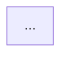

# Mermaid Diagram Update Workflow

## Overview

Diagram fragments in Hanawa store bilingual Mermaid diagrams (EN/JA) with pre-rendered SVGs in R2.

**Source of truth:** D1 database (`fragments` table)
**Rendered output:** R2 bucket (`diagrams/{id}-en.svg`, `diagrams/{id}-ja.svg`)

---

## Workflow: Updating a Diagram

### Option 1: Via Hanawa UI (Manual)

1. Go to `https://hanawa.esolia.co.jp/fragments/{fragment-id}`
2. Click **Edit**
3. Click **Edit** on the Mermaid block to modify the source
4. Save changes
5. Click **Export** to regenerate SVGs and upload to R2

### Option 2: Via Claude Code (Programmatic)

**Step 1:** Update D1 with new Mermaid content:

```bash
npx wrangler d1 execute hanawa-db --remote --command "UPDATE fragments SET
  content_en = '<div data-type=\"mermaidBlock\" data-source=\"YOUR_MERMAID_EN_HERE\" data-svg-path=\"diagrams/{id}-en.svg\" class=\"mermaid-block\">...</div>',
  content_ja = '<div data-type=\"mermaidBlock\" data-source=\"YOUR_MERMAID_JA_HERE\" data-svg-path=\"diagrams/{id}-ja.svg\" class=\"mermaid-block\">...</div>',
  updated_at = datetime('now')
WHERE id = '{fragment-id}'"
```

**Step 2:** User clicks **Export** in UI to regenerate SVGs

Or use the export script (if available):

```bash
npm run diagram:export {fragment-id}
```

---

## HTML Structure

Mermaid content is stored in `content_en` and `content_ja` columns as HTML:

```html
<div
  data-type="mermaidBlock"
  data-source="%%{init: {...}}%%
flowchart TB
    ..."
  data-svg-path="diagrams/{id}-en.svg"
  class="mermaid-block"
>
  <div class="mermaid-header">
    <span class="mermaid-type-label">Mermaid Diagram</span>
  </div>
  <div class="mermaid-diagram">
    
  </div>
</div>
```

**Key attributes:**

- `data-source`: Raw Mermaid code (HTML-escaped)
- `data-svg-path`: R2 path for rendered SVG

---

## Escaping Rules

When writing SQL, escape these characters in the Mermaid source:

| Character          | Escaped as |
| ------------------ | ---------- |
| `'` (single quote) | `''`       |
| `"` (double quote) | `&quot;`   |
| `<`                | `&lt;`     |
| `>`                | `&gt;`     |
| `&`                | `&amp;`    |

---

## Compact Mermaid Config

For tighter diagrams, use init config:



| Property      | Default | Compact | Ultra-compact |
| ------------- | ------- | ------- | ------------- |
| `nodeSpacing` | 50      | 25-30   | 15-20         |
| `rankSpacing` | 50      | 35-40   | 25-30         |
| `padding`     | 8       | 6-8     | 4             |

---

## Scripts

### Export diagrams to YAML backup

```bash
npm run diagram:backup
# or
npx tsx scripts/export-diagram-yaml.ts
```

### Export single diagram

```bash
npx tsx scripts/export-diagram-yaml.ts password-vault-master-password
```

---

## File Locations

| Item         | Location                                       |
| ------------ | ---------------------------------------------- |
| D1 Database  | `hanawa-db` (Cloudflare)                       |
| R2 SVGs      | `codex` bucket, `diagrams/` prefix             |
| YAML Backups | `content/fragments/diagrams/*.yaml`            |
| This doc     | `packages/hanawa-cms/docs/diagram-workflow.md` |
