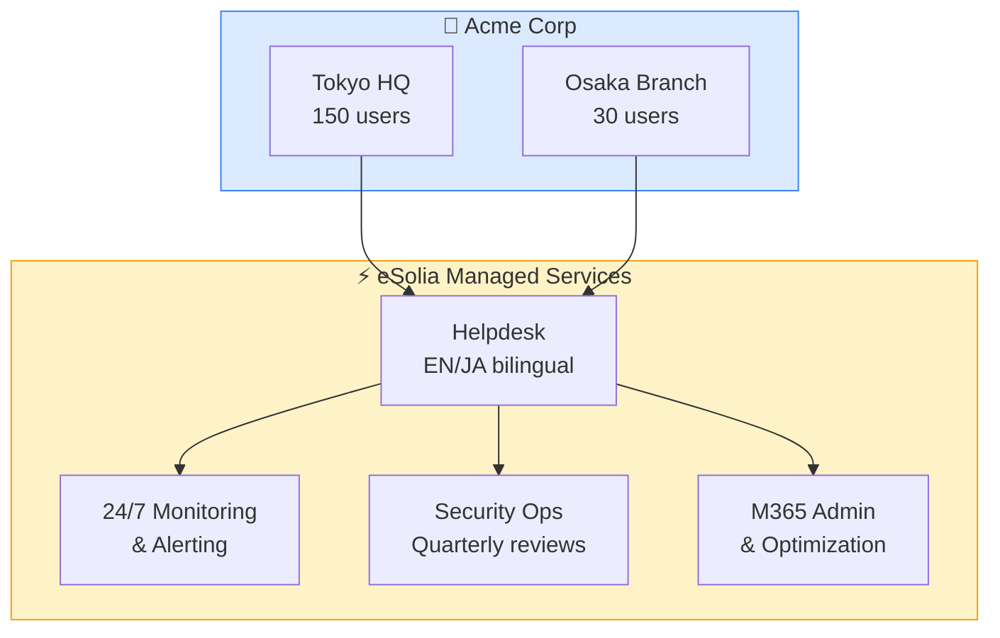

# IT Infrastructure Support Proposal

## Executive Summary

eSolia proposes a comprehensive IT infrastructure support agreement for **Acme Corporation Japan K.K.**, covering managed services, security operations, and helpdesk support for your Tokyo headquarters and Osaka branch office.

This proposal is based on our discussions on 15 February 2026 and reflects your requirements for:

- 24/7 monitoring of critical systems
- Bilingual (EN/JA) helpdesk support during business hours
- Quarterly security assessments
- Microsoft 365 administration and optimization

> **Note:** All pricing is valid for 30 days from the date of this document. Annual contracts receive a 10% discount on the total engagement fee.

## Service Architecture

## Pricing Summary

| Service | Monthly Fee | Annual Fee | Notes |
|---------|------------|------------|-------|
| TotalSupport (Tokyo) | ¥850,000 | ¥9,180,000 | 150 users, unlimited tickets |
| TotalSupport (Osaka) | ¥280,000 | ¥3,024,000 | 30 users, unlimited tickets |
| Security Operations | ¥350,000 | ¥3,780,000 | Quarterly assessment included |
| M365 Administration | ¥180,000 | ¥1,944,000 | License optimization |
| **Total** | **¥1,660,000** | **¥17,928,000** | 10% annual discount applied |

### Payment Terms

1. Invoiced monthly on the 1st business day
2. Payment due within 30 days of invoice
3. Bank transfer to eSolia's designated account
4. All amounts exclude consumption tax (10%)

## Next Steps

Please review this proposal and contact us with any questions:

- **Rick Cogley** — rick@esolia.co.jp, +81-3-4577-3380
- **Schedule a call** — https://esolia.co.jp/contact

We look forward to supporting Acme Corporation's IT operations in Japan.

---

*eSolia Inc. — Empowering multinational IT operations since 1999.*
