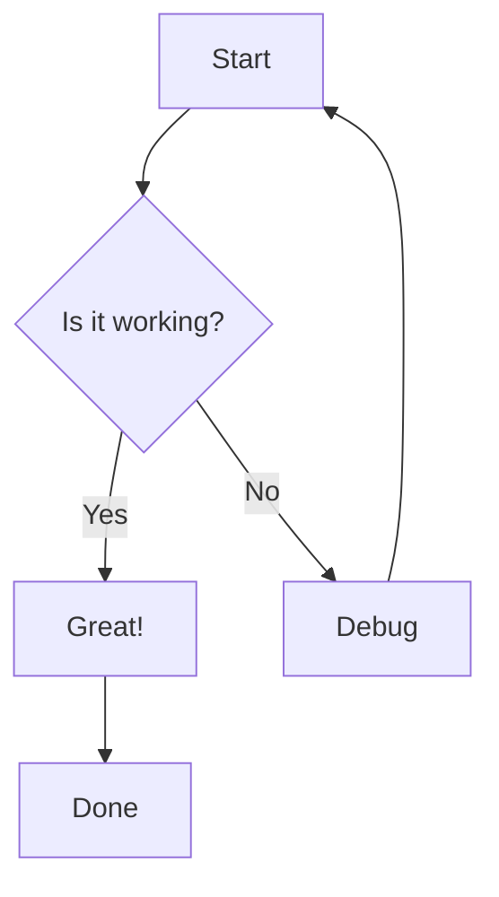
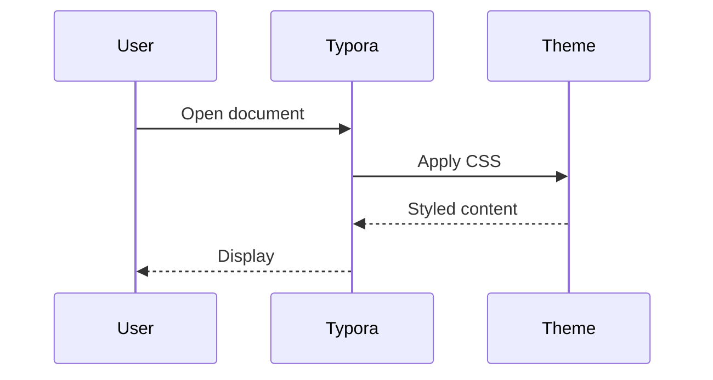

# eSolia Theme Test Document

**Prepared for:** Theme Testing
**Date:** February 2, 2026

---

## About This Document

This is a test document to preview the eSolia Typora theme. It contains various Markdown elements to verify styling.

## Typography

### Headings (H3)

#### Fourth Level Heading (H4)

##### Fifth Level Heading (H5)

###### Sixth Level Heading (H6)

### Body Text

This is regular body text. It should be clear and readable with proper line spacing for both English and Japanese (日本語) content. The font should be IBM Plex Sans JP.

**Bold text** is used for emphasis. *Italic text* is used for technical terms or titles. ~~Strikethrough~~ for deleted content.

### Links

- [eSolia Website](https://esolia.co.jp)
- [Google](https://google.com)

---

## Code

### Inline Code

Use `npm install` to install dependencies. The config file is `package.json`.

### Code Blocks

```javascript
// JavaScript example
function greet(name) {
    console.log(`Hello, ${name}!`);
    return name.toUpperCase();
}

greet('eSolia');
```

```python
# Python example
def calculate_total(items):
    """Calculate the total price of items."""
    return sum(item.price for item in items)
```

---

## Lists

### Unordered List

- First item
- Second item
  - Nested item A
  - Nested item B
- Third item

### Ordered List

1. First step
2. Second step
   1. Sub-step A
   2. Sub-step B
3. Third step

### Task List

- [x] Create theme CSS
- [x] Add IBM Plex Sans JP font
- [ ] Test export to PDF
- [ ] Deploy to team

---

## Blockquotes & Callouts

> This is a standard blockquote. It should have a blue left border and light blue background.

> **ℹ️ Note:** This is an informational callout. Use these to highlight important information for the reader.

> **⚠️ Warning:** This is a warning callout. Use these for critical notices.

---

## Tables

| Feature | Codebook | 1Password | Bitwarden |
|---------|----------|-----------|-----------|
| Price | $60/year | $36/year | Free–$10/year |
| Platforms | Win, Mac, iOS, Android | All + Linux | All + Linux |
| Open Source | Encryption only | No | Yes |
| Web Vault | No (by design) | Yes | Yes |

---

## Images

Images should be responsive and have subtle rounded corners:

*(Add an image here to test)*

---

## Mermaid Diagrams





---

## Horizontal Rule

Above and below this text are horizontal rules. They should have a gradient from orange to navy blue.

---

## Japanese Text Sample / 日本語サンプル

### 日本語テキスト

これは日本語のテストテキストです。IBM Plex Sans JP フォントは、日本語と英語の両方を美しくレンダリングするように設計されています。

#### 引用文

> パスワードマネージャーは、デジタルアイデンティティを保護するための必須ツールです。しかし、すべてのパスワードマネージャーが同じ設計思想で作られているわけではありません。

---

## Contact / お問い合わせ

**eSolia Inc.**
Shiodome City Center 5F (Work Styling)
1-5-2 Higashi-Shimbashi, Minato-ku, Tokyo, Japan 105-7105
**Tel (Main):** +813-4577-3380
**Web:** https://esolia.co.jp/en
